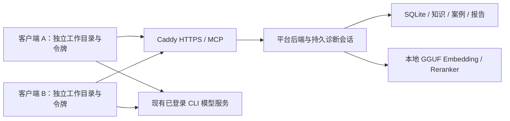

# 本地多客户端 CLI 推理实测（2026-09-07）

## 结论与范围

已用两个真实 Codex CLI 进程，通过个人令牌连接同一个本地 HTTPS 试点服务器，
完成并发诊断、客户端中断恢复、证据校验和报告持久化。
这是单台 Windows 上的进程级分机模拟，尚不代表两台物理电脑、虚拟机或不同操作系统账户验收。



两个 CLI 共用本机已有模型登录，不是两个独立模型账户的配额测试。
CLI 负责推理，平台执行检索、证据与状态校验、存储和报告生成；后端未调用 Chat 模型。
所有输入均为脚本内合成数据。

## 已验证结果

首次完整成功记录：`artifacts/lan/multi-cli-20260907-c/result.json`，262.71 秒。
停机后补充核验：同目录 `after-shutdown.json`。
最终脚本复跑：`artifacts/lan/multi-cli-20260907-d/result.json`，355.64 秒，自动核验、令牌撤销与结束清理全部通过。
下表以最终复跑结果为准；两个运行均成功，相关会话/MCP/诊断及验证器回归共 39 项通过，仓库护栏 24 项通过。

| 项目 | 实测结果 |
| --- | --- |
| 两个真实 CLI 客户端 | 各自工作目录、SQLite 状态目录、平台账户与令牌；同时运行 |
| 模型诊断 | A 判定欠压重启；B 判定凭据错误；均完成两轮规划 |
| 工具闭环 | 状态检查、方法读取、知识检索、日志搜索、证据读取、规划提交、最终诊断、HTML 报告 |
| 故障注入 | A 读取方法后被终止；新 CLI 进程接续同一个持久诊断会话；B 此时继续运行 |
| 防止重复 | 每个案例只产生一个诊断会话和一个完成的诊断结果 |
| 会话权限 | 另一工程师通过新 MCP 连接读取对方诊断会话被拒绝 |
| 引用 | 每客户端 3 项事实均有当前案例日志；各自 5 个引用均在允许范围内 |
| 本地检索 | 10 次 Embedding、2 次 Reranker、0 次后端 Chat；E/R 审计均成功且仅访问 loopback |
| 停机保留 | 重新只读打开 SQLite 后，知识、案例和诊断仍在；两份报告文件 SHA256 与数据库一致；测试令牌已撤销 |

报告可在成功运行目录的 `power-report.html` 和 `authentication-report.html` 查看。
原始 CLI JSONL 留在独立、被 Git 忽略的 artifacts 目录，包含合成诊断内容。

## 复现

从仓库根目录执行，`--output` 必须是尚不存在的新目录：

```powershell
& .venv/Scripts/python.exe -B scripts/verify_multiclient_cli.py `
  --package artifacts/lan/server-pilot-20260907 `
  --codex '<已登录的 codex.exe 完整路径>' `
  --output artifacts/lan/multi-cli-new
```

脚本也支持服务器包内的 Python；必须带 `-B`，避免在完整性受检的软件包中生成额外字节码。
默认超时 1800 秒，可用 `--timeout` 调整。服务器必须含完整的两个 GGUF 检索组件。
脚本创建临时客户端目录和新的服务器数据目录，不使用现有业务数据库。
成功时撤销测试工程师令牌、关闭自建进程；失败时也尝试取消未完成会话并撤销令牌。
独立服务器数据目录保留用于审计，不能当成正式服务器直接部署。

每次 CLI 调用使用临时 MCP 配置和专用 CA bundle，不写全局配置，不关闭 TLS 校验，
不安装 Windows 服务或根证书。子进程沿用已有系统代理，loopback MCP 显式直连。
Codex 的自定义 CA 配置依据 [官方环境变量文档](https://learn.chatgpt.com/docs/config-file/environment-variables)，
远程 MCP 参数依据 [官方 MCP 文档](https://learn.chatgpt.com/docs/extend/mcp?surface=cli)。

首次排查中，模型连接多次 WebSocket 超时，最小独立 CLI 最终回退 HTTPS 后成功；
沿用系统代理后完整测试通过。另一次启动被包完整性检查拦截，原因是排查命令漏用 `-B`
生成了 31 个额外 `.pyc`；已仅清理这些生成文件。两次排查记录未算作成功验收。
最终复跑中出现一次模型响应流网络断开，CLI 自动重连后完成；本次结果不是零网络错误声明，
也不能据此把此前另一对话的报错归因为对话轮次过多。

## 验收边界

- 已有 10 账户、40 次并发案例读写测试；本次仅验证 2 个同时运行的 CLI 诊断，未证明 10 个同时推理任务的吞吐。
- 本次故障是客户端进程终止及服务器正常退出，未模拟断电、磁盘损坏或异机恢复。
- 未调用公司魔改 CodeAgent，也未验证第二台电脑的 DNS、防火墙、证书信任、代理和实际 CLI 安装。
- 合成案例是小规模闭环验证，不能替代代表性历史故障的准确率评测和复杂故障树覆盖测试。
- 本次仅增加验证脚本、验证器测试和文档，没有修改产品运行代码；既有产品 Full 记录见 [VALIDATION.md](../VALIDATION.md)。

正式分机试点下一步是在第二台公司电脑安装轻客户端，使用该电脑自己的个人令牌与实际 CodeAgent，
先重复上述合成案例，再按已批准模型端点策略使用业务样本。
