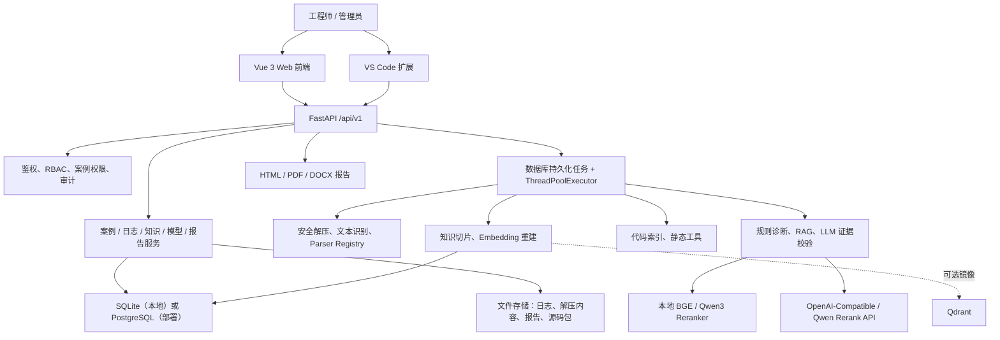
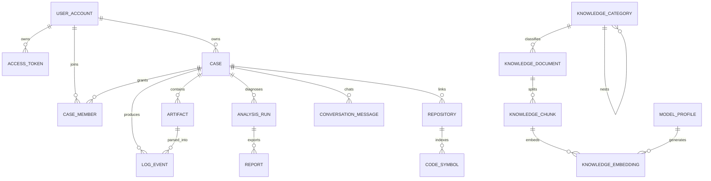
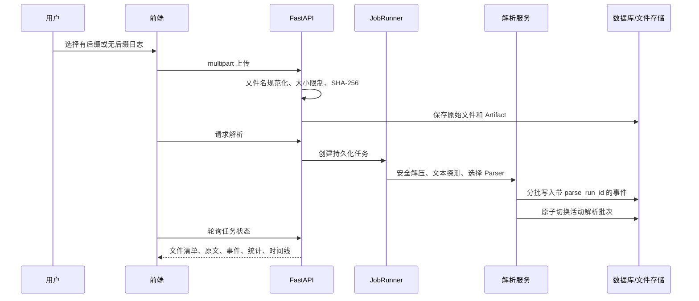
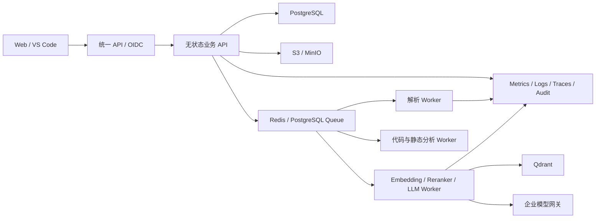

# GW/AP 智能调试平台：架构、技术栈与迭代说明

> 文档状态：2026-07-23，随仓库版本维护。
> 适用范围：当前 `debug-platform` 单体仓库，包括 Web 前端、后端 API、后台任务、VS Code 扩展、部署脚本和本地模型支持。

## 1. 项目定位

本项目面向 GW、AP、全光网关等网络设备的调试场景，将“上传日志—解析事实—检索知识—辅助诊断—关联代码—生成报告”整合为一个可在普通 Win11 电脑上本地运行、也可使用 Docker 部署的平台。

它的核心原则是：

- 原始日志、结构化事实、知识证据和模型推断分层保存；
- 即使没有任何外部模型 API，也可以用规则、BM25 和内置 Hashing Embedding 完成基础闭环；
- LLM 只能基于后端提供的证据给出辅助判断，不能直接修改日志、代码或自动应用补丁；
- 本地单机优先，同时为 PostgreSQL、Qdrant 和 OpenAI-Compatible 模型网关保留扩展路径；
- 上传、解析、诊断、模型外发和权限操作均设置明确的安全边界。

项目当前属于“可运行的工程化内部诊断平台”，不是已经完成所有厂商格式适配的商业成品。最重要的后续工作仍然是真实日志样本回归、生产级身份体系、可观测性和分布式任务能力。

## 2. 总体架构



当前形态是模块化单体：

- 前端与后端分别构建；
- 后端 API、领域服务和后台任务运行在同一个 Python 进程；
- 关系数据由 SQLAlchemy 管理；
- 大文件保存在文件系统，数据库保存路径、哈希、状态和结构化结果；
- Qdrant 是可选向量镜像，关系库中的 Embedding 仍是可回退的数据源；
- Docker Compose 将前端、后端、PostgreSQL 和 Qdrant 分为独立容器。

这种结构适合单机和小团队部署，开发和排错成本较低；如果未来需要多后端实例、高并发或跨部门共享，则应把任务执行、对象存储和向量索引进一步服务化。

## 3. 技术栈

### 3.1 后端

| 领域 | 技术 | 当前用途 |
| --- | --- | --- |
| 语言与运行时 | Python 3.11+ | 后端、任务、运维脚本、测试 |
| Web API | FastAPI、Uvicorn | REST API、Swagger、健康检查、文件上传 |
| 数据校验 | Pydantic 2、pydantic-settings | 请求/响应模型和 `.env` 配置 |
| ORM 与迁移 | SQLAlchemy 2、Alembic | 数据访问、约束、SQLite/PostgreSQL 迁移 |
| 数据库 | SQLite / PostgreSQL 17 | 本地默认 SQLite；Docker 部署默认 PostgreSQL |
| HTTP 与模型 API | OpenAI Python SDK、HTTPX | OpenAI-Compatible Chat/Embedding 与 Qwen Rerank API |
| 文档生成 | Jinja2、ReportLab、python-docx | HTML 预览、PDF、Word 报告 |
| 检索 | 自研 BM25/精确词项、scikit-learn HashingVectorizer | 无外部模型时的本地检索基线 |
| 本地模型 | Sentence Transformers、Transformers | BGE Embedding、Qwen3 Reranker |
| 向量服务 | Qdrant Client | 可选的向量镜像和查询加速 |
| 文本处理 | charset-normalizer、python-dateutil、PyYAML | 编码、时间和知识内容处理 |
| 密钥保护 | cryptography / Fernet | 模型 API Key 加密保存 |
| PostgreSQL 驱动 | psycopg 3 | PostgreSQL 连接 |

后端依赖采用版本区间约束，锁定策略由 CI 和部署环境负责。大型本地模型依赖放在 `backend[local-models]` 可选依赖组中，避免基础安装强制下载 PyTorch 等大包。

### 3.2 前端

| 技术 | 当前用途 |
| --- | --- |
| Vue 3 Composition API | 页面和交互逻辑 |
| TypeScript | 类型约束和可维护性 |
| Vite 7 | 本地开发、代理和生产构建 |
| Element Plus | 表单、表格、对话框、状态展示 |
| Axios | 调用后端 API、上传与下载 |
| Vue Router | 案例、知识库、系统设置和安全管理路由 |
| Pinia | 已接入应用；当前多数状态仍由页面局部维护 |

主要页面：

- `CasesView.vue`：案例列表和创建；
- `CaseDetailView.vue`：上传、解析、原文浏览、搜索、事件、时间线、诊断、报告和代码关联；
- `KnowledgeView.vue`：知识分类树、文档新增、上传、修改、删除；
- `SettingsView.vue`：Chat、Embedding、Reranker 模型配置、测试、激活和重建索引；
- `SecurityView.vue`：用户、令牌、系统状态和审计事件。

### 3.3 VS Code 扩展

扩展使用 TypeScript、VS Code API、Axios、FormData 和 Archiver，实现：

- 保存或清除访问凭据；
- 创建案例；
- 上传 collectDebuginfo；
- 上传当前工作区并关联案例；
- 针对选中代码提问；
- 在浏览器中打开案例。

访问凭据优先使用 VS Code SecretStorage；配置项中的明文 API Key 仅作为旧版本兼容入口。

### 3.4 工程与运维

| 领域 | 技术 |
| --- | --- |
| Windows 启动 | BAT + PowerShell |
| Linux/macOS 启动 | Shell |
| 容器部署 | Docker、Docker Compose、Nginx |
| 持续集成 | GitHub Actions |
| 后端质量 | pytest、Ruff、compileall、pip-audit |
| 前端质量 | vue-tsc、Vite build、npm audit |
| 外部服务验证 | PostgreSQL、Qdrant 服务容器测试 |
| Windows 端到端冒烟 | 隔离数据库和备用端口启动前后端 |

## 4. 仓库结构

```text
debugplatform/
├─ backend/
│  ├─ app/
│  │  ├─ api/                 # REST 路由
│  │  ├─ core/                # 配置、数据库、迁移、鉴权、通用工具
│  │  ├─ migrations/          # Alembic 迁移
│  │  ├─ seed_knowledge/      # 内置诊断知识
│  │  ├─ services/            # 领域服务、任务、解析器、RAG、报告
│  │  ├─ main.py              # FastAPI 入口和生命周期
│  │  ├─ models.py            # SQLAlchemy 数据模型
│  │  └─ schemas.py           # Pydantic API 模型
│  ├─ tests/                  # 后端和跨模块测试
│  ├─ Dockerfile
│  └─ pyproject.toml
├─ frontend/
│  ├─ src/views/              # 五个核心业务页面
│  ├─ src/api.ts              # Axios 客户端
│  ├─ src/router/             # 前端路由
│  ├─ Dockerfile
│  └─ package.json
├─ vscode-extension/          # VS Code 客户端
├─ scripts/                   # 启动、体检、冒烟、备份、用户和模型脚本
├─ docs/                      # 专题文档
├─ models/                    # 本地模型，Git 忽略
├─ docker-compose.yml
├─ .env.example
└─ .github/workflows/ci.yml
```

## 5. 后端模块划分

### 5.1 API 与访问控制

`backend/app/api/routes.py` 暴露系统、案例、附件、事件、诊断、知识、代码仓库、任务、模型和安全管理接口。

鉴权支持三种模式：

- `local`：本机开发模式，不能用于 `APP_ENV=prod`；
- `api_key`：共享 API Key；
- `rbac`：本地用户、个人访问令牌和角色权限。

RBAC 之外还有案例级成员关系。案例所有者或管理员可以授予成员 `VIEWER`、`EDITOR` 等权限，实现案例之间的数据隔离。模型管理、知识修改和用户管理等敏感操作要求相应角色。

### 5.2 文件存储与安全解压

文件层保存：

- 原始上传物；
- 解压后的日志文件；
- 代码仓库压缩包及解压目录；
- 生成的 PDF、DOCX 等报告。

数据库只保存受控存储键，不直接信任用户路径。上传和解压包含以下限制：

- 默认上传上限 2 GiB；
- 默认解压总量上限 8 GiB；
- 默认归档文件数上限 20,000；
- 默认单文件上限 512 MiB；
- 默认目录深度上限 20；
- 防止路径穿越、符号链接和非普通文件；
- 记录 SHA-256 和文件大小。

### 5.3 日志识别与解析器注册表

解析入口不只依赖扩展名。上传无后缀日志时会规范化为 `.txt` 存储名，同时保留原始文件名；解压后还会根据内容探测文本。

内置解析器：

- `huawei-collectdebuginfo`：识别 `Start run collect command:` 命令段，以及 `NOTICE 2026-... 03:29:17.483[...]` 等运行日志；
- `json-line`：解析逐行 JSON 日志；
- `generic-log`：通用时间、级别、模块和错误规则。

解析器通过 `Parser Registry` 注册，并按探测置信度选择。新厂商格式可以新增独立 Parser，而不必把所有规则塞入通用解析器。

### 5.4 大日志处理

当前大日志路径针对 10 万行以上文本做了专门设计：

- 以迭代器流式读取，而不是一次性加载完整文件；
- 每 5,000 条事件批量写入数据库；
- 每 500 行记录一个稀疏文件偏移索引；
- 原文浏览可按起始行跳转；
- 搜索设置最大扫描行数，避免单请求无限占用；
- 允许少量 NUL 字节，避免厂商文本因局部异常被直接当作二进制拒绝；
- 编码和控制字节仍会做内容探测；
- 单个可解析文本默认限制为 128 MiB；
- 解析过程支持进度、取消、失败回滚和重试。

每次解析使用独立 `parse_run_id`。新结果完成并提交后才替换旧的活动结果；失败或取消时只清理本次临时事件，避免把上一次可用结果破坏掉。

### 5.5 后台任务

当前任务类型包括：

- 日志解析；
- 案例诊断；
- 知识向量重建；
- 代码仓库索引；
- 静态分析。

任务元数据和状态持久化到 `jobs` 表，执行器使用进程内 `ThreadPoolExecutor`。它支持：

- 活动任务去重；
- 进度和消息；
- 取消请求；
- 失败信息；
- 重试；
- 后端重启后恢复未完成任务；
- 业务结果和任务完成状态在关键路径上协调提交。

限制是：执行器只适合单后端进程。多个后端实例会缺少真正的分布式租约和队列语义。

### 5.6 诊断、RAG 与证据校验

检索流程由多路信号组成：

1. 对知识分块和当前案例代码符号计算 BM25；
2. 加入精确词项、标题命中和知识可信度加权；
3. 若活动 Embedding 索引可用，加入向量相似度；
4. 取较大的候选集；
5. 若活动 Reranker 可用，执行重排；
6. 向规则诊断或 LLM 提供带 `evidence_id` 的证据。

诊断先构造确定性规则结果，再选择 Mock 或 OpenAI-Compatible Chat 模型进行综合。LLM 返回值使用 Pydantic 结构校验，并检查：

- 置信度范围；
- 根因、事实、建议的数据结构；
- 引用的 `evidence_id` 是否真实存在；
- 提示词证据字符上限；
- 模型调用失败时回退到确定性结果。

每次分析保存使用的 Provider、模型名、模型配置快照和提示版本，但不保存明文 API Key。后续切换模型不会篡改历史分析的审计信息。

### 5.7 代码关联与静态分析

案例可以上传代码仓库压缩包。当前索引器主要面向 C/C++：

- 提取函数、宏和结构体；
- 保存文件、行号、签名、代码片段和简单调用关系；
- 将代码符号加入案例范围内的 RAG 候选；
- 可运行白名单中的 `cppcheck`、`clang-tidy`；
- `clang-tidy` 需要 `compile_commands.json`；
- 补丁建议只生成候选，不自动写入源码。

当前符号提取主要使用正则和花括号扫描，不等同于 Clang AST，复杂宏、模板、条件编译和生成代码可能解析不完整。

### 5.8 报告

分析结果可以：

- 在浏览器预览 HTML；
- 导出 PDF；
- 导出 DOCX；
- 保存版本号、文件路径和 SHA-256；
- 通过受控下载接口获取。

## 6. 数据模型

### 6.1 主要实体

| 实体 | 作用 |
| --- | --- |
| `UserAccount` | 用户、显示名、角色和启用状态 |
| `AccessToken` | 个人访问令牌哈希、提示、过期和撤销状态 |
| `Case` | 故障案例、设备、版本、现象、严重度和所有者 |
| `CaseMember` | 案例成员和案例级权限 |
| `Artifact` | 日志、源码包和报告输入的元数据、哈希、状态 |
| `LogEvent` | 标准化日志事件、时间、级别、模块、行号和 Parser 信息 |
| `KnowledgeCategory` | 支持父子层级的知识分类 |
| `KnowledgeDocument` | 诊断规则、历史问题、故障树、方案和参考资料 |
| `KnowledgeChunk` | 可检索的知识分块 |
| `KnowledgeEmbedding` | 按 Embedding Profile 隔离的向量 |
| `ModelProfile` | Chat、Embedding、Reranker 的本地/API 配置 |
| `Repository` | 与案例绑定的源码仓库 |
| `CodeSymbol` | 源码函数、宏、结构体及位置 |
| `AnalysisRun` | 一次诊断结果、证据和模型快照 |
| `Job` | 后台任务状态 |
| `ConversationMessage` | 案例问答和引用 |
| `Report` | 报告版本、格式、路径和哈希 |
| `AuditEvent` | 操作者、动作、资源、结果和请求上下文 |

### 6.2 关系概览



知识分类与文档当前在数据库中通过关联表维护；上图为便于理解而简化了中间关联表。

### 6.3 迁移历程

当前 Alembic 迁移包含：

1. 基础业务表；
2. 运行期完整性和约束增强；
3. 分析模型配置快照；
4. 原子解析批次；
5. 审计事件；
6. RBAC、令牌和案例成员。

后端启动时会自动执行迁移。生产升级前仍应先备份，并禁止手工修改 `alembic_version`。

## 7. 核心业务流程

### 7.1 日志上传与解析



### 7.2 诊断

```text
结构化日志事件
  + 案例设备信息
  + 分层知识文档
  + 案例内代码符号
        ↓
BM25 / 精确词项 / Embedding 混合召回
        ↓
可选 Reranker
        ↓
确定性规则诊断
        ↓
可选 LLM 综合
        ↓
结构、置信度和 evidence_id 校验
        ↓
分析快照、问答引用和报告
```

### 7.3 知识编辑与索引

知识库支持：

- 分类新增、修改、删除和父子层级；
- 文档新增、文件上传、查看、修改和删除；
- 诊断规则、协议规则、产品规则、安全规则；
- 历史问题、故障树、解决方案；
- 产品资料和协议资料；
- 设备、型号、固件、模块、可信度和保密级别元数据；
- 内容切片；
- 切换 Embedding 后异步重建全量向量。

当前“故障树”仍是分类下的文档内容，不是可执行的图数据库节点和边。

### 7.4 模型配置与切换

模型按任务分为：

| 任务 | 内置 | 本地 | API |
| --- | --- | --- | --- |
| Chat/诊断 | Mock/规则引擎 | 暂未提供本地 Chat 运行器 | OpenAI-Compatible |
| Embedding | Hashing 384 维 | Sentence Transformers / BGE | OpenAI-Compatible Embedding |
| Reranker | Disabled | Sentence Transformers / Qwen3 | Qwen Rerank API |

前端可以新增、修改、删除、测试和激活多个 Profile。同一任务只允许一个活动配置。Embedding 切换后必须重建知识向量；旧向量按 `profile_id` 隔离，不会误用到新模型。

API Key 在后端使用 Fernet 加密，只返回“是否已配置”和尾部提示，不回显明文。模型端点在保存、激活和实际请求前均检查协议、主机、内网、回环和云元数据地址。

## 8. 本地模型目录与安装方式

目录约定：

```text
models/
├─ inference/                         # 预留给后续本地 Chat/推理模型
├─ embedding/
│  └─ bge-base-zh-v1.5/              # BAAI/bge-base-zh-v1.5
└─ reranker/
   └─ Qwen3-Reranker-0.6B/           # Qwen/Qwen3-Reranker-0.6B
```

`scripts/install_local_models.bat` 调用 PowerShell 安装器。安装器的关键顺序为：

1. 创建 `inference`、`embedding`、`reranker`；
2. 确认项目 `.venv`；
3. 设置 `$env:HF_ENDPOINT = "https://hf-mirror.com"`，并关闭误继承的离线模式；
4. 安装固定兼容范围的 `backend[local-models]`，使 `.venv\Scripts\hf.exe` 可用；
5. 锁定 BGE 和 Qwen3 的模型 revision；
6. 先使用官方 CLI 下载 `config.json` 做轻量预检，成功后使用 CLI 下载：

```powershell
$env:HF_ENDPOINT = "https://hf-mirror.com"

.\.venv\Scripts\hf.exe download BAAI/bge-base-zh-v1.5 `
  --local-dir .\models\embedding\bge-base-zh-v1.5

.\.venv\Scripts\hf.exe download Qwen/Qwen3-Reranker-0.6B `
  --local-dir .\models\reranker\Qwen3-Reranker-0.6B
```

7. 如果 CLI 因代理或镜像 HEAD 元数据响应失败，自动改用 `curl.exe`，通过镜像 API 获取固定 revision 的文件清单；
8. curl 回退使用 `.partial` 断点续传，验证目标路径、文件大小和 LFS 权重 SHA-256；
9. 校验 `config.json`、Tokenizer 和模型权重；
10. 生成包含下载方式和 revision 的 `models/model-installation.json`；
11. 通过项目自身的 Embedding、Reranker 适配器真实加载并执行最小推理。

这里没有把 Qwen 模型直接放在 `models\Qwen3-Reranker-0.6B`，是因为项目需要长期维持“推理 / Reranker / Embedding”三类目录，避免后续模型增多时路径混乱。

`hf download --local-dir` 会在目标目录创建 Hugging Face 元数据缓存；curl 路径会保留 `.partial` 文件。两种方式重复运行都能复用已完成内容。`scripts/check_hf_model_access.bat` 只下载 `config.json` 并生成脱敏报告，用于判断 CLI、镜像 API 和 curl 回退是否可用。`models/` 已加入 `.gitignore`，权重不会被提交到 GitHub。

## 9. 部署与运行模式

### 9.1 Win11 本地模式

`scripts\start_local.bat` 负责：

- 检查并创建 `.venv`；
- 安装后端依赖；
- 检查 Node.js 和前端依赖；
- 执行数据库迁移；
- 分别启动后端与 Vite；
- 只绑定 `127.0.0.1`；
- 检测 8000 端口是否被其他服务占用。

配套脚本：

- `doctor_local.bat`：检查 Python、Node、依赖、端口、数据库和目录；
- `runtime_smoke.bat`：用隔离 SQLite 数据库、18000/15173 端口启动完整前后端并冒烟；
- `inspect_log_file.bat`：检查日志大小、行数、头部字节、编码、NUL 和 Parser 预测；
- `backup_local.bat` / `restore_local.bat`：SQLite 本地备份和受确认保护的恢复；
- `manage_users.bat`：用户和令牌管理；
- `check_hf_model_access.bat`：模型镜像、代理、CLI 与 curl 回退检测；
- `install_local_models.bat`：镜像下载和模型兼容性验证。

### 9.2 Docker 模式

Docker Compose 包含：

- PostgreSQL；
- Qdrant；
- FastAPI 后端；
- Nginx 托管的前端。

数据库、向量和文件分别保存在 Docker Volume。宿主机端口只绑定 `127.0.0.1`，PostgreSQL 和 Qdrant 不直接暴露。

### 9.3 健康与备份

健康接口分为：

- liveness：进程是否存活；
- readiness：数据库和存储是否可用；
- system status：数据库方言、存储空间、任务数量和实体数量。

内置备份面向本地 SQLite，使用 SQLite 在线快照、ZIP 清单、逐文件 SHA-256 和恢复回滚目录。PostgreSQL 部署应使用企业标准的 `pg_dump`、`pg_restore` 和存储备份方案。

## 10. 已实现功能清单

### 案例与协作

- 创建、查看、修改和删除案例；
- 设备类型、型号、固件、拓扑、复现步骤、时间、状态和严重度；
- 所有者和案例成员权限；
- 跨案例数据隔离。

### 日志

- 压缩包、普通文本和无后缀日志上传；
- 无后缀日志自动规范化为 `.txt`；
- 安全解压和文件清单；
- 内容型文本探测与编码提示；
- 华为 collectDebuginfo、JSON Lines 和通用日志 Parser；
- 原始日志分页、跳行和关键字搜索；
- 事件筛选、统计和时间线；
- 大日志流式解析、批量写入和稀疏行索引；
- 原子重解析、取消、失败回滚和重试；
- 独立日志体检脚本。

### 诊断

- GW/WAN、DHCP、PPPoE、WLAN、hostapd、PON、OMCI、TR-069、内核和进程异常规则；
- 规则诊断；
- BM25、精确词项、Embedding 混合检索；
- 可选 Reranker；
- OpenAI-Compatible LLM；
- 证据编号、置信度和返回结构校验；
- 案例问答和引用；
- HTML、PDF、DOCX 报告。

### 知识库

- 层级分类；
- 诊断规则、历史故障、故障树、解决方案和参考资料分类；
- 文档新增、上传、查看、修改和删除；
- 内容切片、Embedding 索引和全量重建；
- 设备、版本、模块、可信度和保密性元数据。

### 模型网关

- 前端管理多套 Chat、Embedding 和 Reranker；
- 内置、本地、API 三种模式；
- 测试、激活、停用和删除；
- API Key 加密、不回显；
- 外发端点和 SSRF 风险校验；
- 模型外发审计；
- 分析时保存无密钥配置快照；
- 本地 BGE Base 和 Qwen3 Reranker 安装器。

### 代码与工程

- 案例绑定源码压缩包；
- C/C++ 函数、宏和结构体索引；
- 代码符号检索；
- `cppcheck`、`clang-tidy` 白名单执行；
- 候选补丁建议，不自动应用；
- VS Code 上传、提问和跳转。

### 安全与运维

- local、API Key、RBAC 三种鉴权；
- 用户、个人令牌、角色和案例成员；
- 令牌只保存哈希；
- 审计事件；
- 上传、解压和路径限制；
- 敏感字段、MAC、IP、SN 脱敏；
- 健康、就绪和系统状态；
- 数据库迁移；
- SQLite 备份、校验、恢复回滚；
- Windows 诊断和隔离冒烟；
- Windows/Linux CI、依赖审计、Docker 构建和外部服务测试。

## 11. 迭代历程

| 日期 | 提交 | 迭代内容 | 解决的问题 |
| --- | --- | --- | --- |
| 2026-07-21 | `33bfc54` | 初始化仓库 | 建立版本控制起点 |
| 2026-07-21 | `4b4c9b9` | 导入完整平台工程 | 形成前后端、脚本、扩展和部署骨架 |
| 2026-07-21 | `5f7a430` | 修复可移植本地启动 | 不再依赖特定电脑工作目录，改善 Win11 克隆即用 |
| 2026-07-21 | `f881d77` | 增加华为无后缀日志解析 | 支持 collectDebuginfo 命令段和运行日志 |
| 2026-07-22 | `0a0cb48` | 无后缀上传规范化和日志体检 | 自动补 `.txt`，提供公司电脑可运行的检测文件 |
| 2026-07-22 | `52822f0` | 支持文本中的少量 NUL | 避免局部异常字节导致整份日志被判定为二进制 |
| 2026-07-22 | `4d57d54` | 修复解析器注册 | 新进程中确保内置 Parser 自动加载 |
| 2026-07-22 | `a9aa92f` | 模型网关和分层知识库 | 前端多模型切换、Embedding/Reranker、分类和文档修改 |
| 2026-07-22 | `08e932f` | Windows 启动和诊断强化 | 增加 Doctor、运行时冒烟和跨电脑启动保障 |
| 2026-07-23 | `a4ce133` | P0 安全和运维强化 | RBAC、审计、备份、健康、解析原子性和部署验证 |
| 2026-07-23 | `e6caa77` | 大日志 Windows 稳定性 | 流式解析、批量写入、稀疏索引和任务状态修复 |
| 2026-07-23 | `60df9f8` | 本地模型安装器 | 创建三级目录、镜像下载、文件与适配器验证 |
| 2026-07-23 | `583f8da` | 改用 `hf download --local-dir` | 让公司环境中的下载命令透明、直接并便于手工复现 |
| 2026-07-23 | 本文版本 | 模型下载诊断和回退 | 增加脱敏检测报告、固定 revision、curl 断点续传和哈希校验 |

这段迭代体现了项目从“功能原型”逐步转向“可在多台 Win11 电脑复现、可诊断、可回滚、可审计”的工程化过程。

## 12. 当前优点

### 12.1 离线可用和逐级增强

没有 API Key 时仍可使用解析、规则、BM25、Hashing Embedding 和报告；有本地模型后可增强语义检索和排序；有批准的 API 后再启用 LLM。企业环境可以按数据合规等级逐步开放能力。

### 12.2 证据驱动

诊断不是让 LLM 直接阅读无限量原始日志并自由回答，而是先结构化事实和检索证据，再验证模型引用。历史分析保存模型快照，便于复盘。

### 12.3 针对真实大日志问题做了工程处理

无后缀、混合编码、少量 NUL、10 万行以上文本、Windows SQLite 写入速度、任意行浏览和原文搜索都有对应实现，不只停留在小样例演示。

### 12.4 扩展点清晰

Parser、模型 Profile、知识分类、任务类型、报告格式和静态工具都有相对明确的边界。新厂商 Parser 或新模型适配器可以局部扩展。

### 12.5 本地和容器两条运行路径

普通工程师可以双击 BAT 使用；团队部署可以使用 PostgreSQL、Qdrant 和容器。CI 同时验证 Windows 和 Ubuntu，降低“只在开发者电脑可用”的风险。

### 12.6 安全意识较完整

上传限制、解压防护、路径约束、令牌哈希、API Key 加密、模型端点校验、审计、案例隔离和静态工具白名单已经覆盖了内部平台的主要高风险入口。

## 13. 当前缺点与技术债

### 13.1 API 路由文件过大

多数接口集中在 `routes.py`，领域边界虽在 Service 层存在，但路由层继续增长会增加合并冲突和权限遗漏风险。应按 `cases`、`artifacts`、`knowledge`、`models`、`security` 拆分 APIRouter。

### 13.2 后台任务不适合多实例

任务状态在数据库，执行线程却在单进程。多副本部署时缺少分布式租约、可见性超时、死信和集中调度。应引入 Redis/Celery、Dramatiq、RQ，或实现 PostgreSQL `SKIP LOCKED` 的数据库队列。

### 13.3 SQLite 中保存 JSON 向量的规模有限

SQLite 回退可靠，但向量以 JSON 文本保存，文档数量大时存储、反序列化和全量候选计算成本会上升。Qdrant 当前是可选镜像，双写失败和一致性修复还可继续完善。

### 13.4 尚未构建真正的知识图谱

当前有分类树、文档型故障树、元数据和代码调用列表，但没有实体解析、关系边、图查询、图版本和 GraphRAG。因此不能把“分类层级”描述为完整知识图谱。

### 13.5 Parser 的真实产品覆盖仍有限

内置华为 Parser 基于目前掌握的文本特征。不同产品线、版本和内部模块可能存在字段变化。缺少来自真实设备、经过脱敏的 Golden Corpus，是当前诊断准确率最大的风险。

### 13.6 代码索引不是语义级 AST

正则提取对常规 C 代码有效，但对复杂 C++、宏展开、条件编译、模板和生成代码有限。调用关系也只是词法近似。

### 13.7 前端自动化不足

前端有 TypeScript 构建检查和 Windows 运行时冒烟，但没有 Playwright/Cypress 页面级回归，也没有组件测试。页面逻辑较多集中在大型 View 中，Pinia 尚未承担统一任务、权限和模型状态。

### 13.8 本地模型资源要求和供应链仍需治理

CPU 可以加载模型，但 Qwen3 Reranker 首次启动慢、内存占用高。安装器已固定当前批准 revision，并在 curl 回退中校验 LFS 权重 SHA-256，但仍缺少公司级许可证清单、内部离线制品库、恶意模型扫描和资源容量准入。

### 13.9 生产身份和密钥基础设施不足

当前 RBAC 是本地账号和 Token，不含公司 SSO/OIDC、SCIM、MFA、集中密钥托管或自动轮换。Fernet 密钥仍由本地文件或环境管理。

### 13.10 可观测性偏基础

已有健康、系统状态、任务状态和审计，但缺少 Prometheus 指标、结构化日志规范、分布式 Trace、SLO、告警和容量趋势。

### 13.11 文件存储仅为本地文件系统

单机简单可靠，但多实例需要共享对象存储、生命周期、版本和防病毒扫描。当前未集成 S3/MinIO，也没有上传恶意内容扫描。

## 14. 改进空间与建议路线

### P0：上线前必须补齐

1. **真实日志回归集**
   - 对公司日志脱敏；
   - 按产品、版本、模块建立 Golden Files；
   - 固定预期 Parser、事件数、关键事件、时间线和诊断证据；
   - 加入 100 MiB 级别性能门槛。

2. **模型制品治理**
   - 建立 revision 升级审批和回归机制；
   - 归档文件 SHA-256、许可证和来源清单；
   - 公司环境优先使用审核后的内部模型制品库；
   - 下载前检查剩余磁盘，加载前检查内存。

3. **生产鉴权**
   - 接入公司 OIDC/SSO；
   - 明确管理员、知识维护者、诊断工程师、只读用户；
   - 令牌轮换、强制过期和离职回收。

4. **可观测和告警**
   - 解析耗时、行数、事件率、失败率；
   - Job 排队时间和执行时间；
   - 模型延迟、Token、错误和外发量；
   - 磁盘、数据库和 Qdrant 容量；
   - 关键审计事件集中告警。

5. **上传安全**
   - 接入 ClamAV 或公司恶意文件扫描；
   - 文件类型识别与隔离区；
   - 上传保留期限和自动清理策略。

### P1：规模化和可维护性

1. 拆分大型 API 路由和前端大型 View；
2. 引入分布式任务队列和独立 Worker；
3. 生产统一 PostgreSQL，明确事务和连接池参数；
4. 使用 S3/MinIO 取代单机文件目录；
5. 将 Qdrant 提升为正式向量检索服务，并实现可重放索引任务；
6. 增加 Playwright 端到端测试；
7. 把 Parser 做成带版本和样本契约的插件包；
8. 使用 Tree-sitter 或 Clang AST 改进代码索引；
9. 增加诊断评测集，衡量召回率、排序质量、证据正确率和根因 Top-K；
10. 支持 GPU 自动探测、精度/量化选择和模型懒加载。

### P2：平台化能力

1. 构建实体—关系知识图谱和 GraphRAG；
2. 支持多租户、部门空间和知识 ACL；
3. 增加诊断工作流编排、人工审批和结果反馈；
4. 通过反馈闭环评估规则和模型，但禁止未经审批自动学习敏感日志；
5. 支持 Kubernetes、弹性 Worker 和灾备；
6. 建立 Parser、规则、模型和知识文档的版本发布体系；
7. 增加设备拓扑图、事件传播链和跨设备时间对齐。

## 15. 推荐的目标架构

当单机部署无法满足需求时，可逐步演进为：



迁移不必一次完成。建议先保持现有 API 和数据模型稳定，依次替换任务执行器、文件存储、向量主存储和身份入口。

## 16. 质量保障现状

当前测试覆盖的重点包括：

- 鉴权、RBAC、案例隔离和审计；
- 上传、解压、路径和大小安全；
- 无后缀、少量 NUL、华为日志和大日志；
- Parser 注册和解析原子性；
- Job 去重、取消、恢复和失败状态；
- RAG、模型 Profile、模型快照和 LLM 输出校验；
- 迁移、外键和数据库完整性；
- 健康、备份、删除级联和部署文件；
- Windows 启动、Doctor、模型安装器和隔离冒烟；
- PostgreSQL 与 Qdrant 外部服务。

GitHub Actions 当前验证：

- Windows/Ubuntu 后端测试、Ruff 和 compileall；
- Windows/Ubuntu 前端构建；
- VS Code 扩展编译；
- Python 与 npm 依赖审计；
- PostgreSQL/Qdrant 集成测试；
- 后端和前端 Docker 构建；
- Windows 前后端完整启动冒烟。

仍应补充真实模型加载 CI、前端 E2E 和经过审批的真实日志回归。由于模型权重大、公司日志敏感，这两类测试更适合在企业内网 Runner 执行。

## 17. 架构结论

当前项目最强的部分是：从真实 Win11 使用问题出发，已经形成日志解析、证据检索、模型切换、知识管理、代码关联、权限审计和报告的完整闭环，并且保留了无 API、无 GPU 时的可用路径。

当前最大的风险不是“功能数量不够”，而是三个工程化问题：

1. 缺少足够多的真实设备 Golden Corpus；
2. 单进程任务、本地文件和 SQLite 回退不适合大规模多实例；
3. 生产级 SSO、可观测、模型制品治理和安全扫描仍需接入公司基础设施。

后续迭代应优先提高解析和诊断的可验证性，再扩展图谱、自动化和分布式能力。这样可以避免功能不断增加，但准确率、可复现性和生产安全无法证明。
