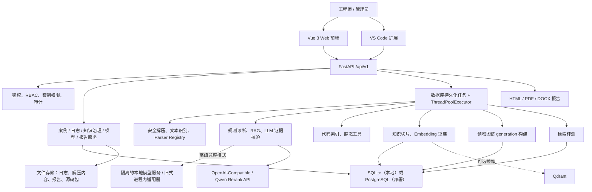
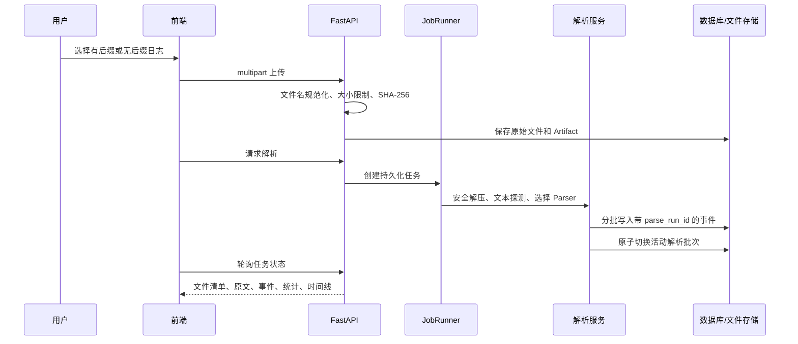
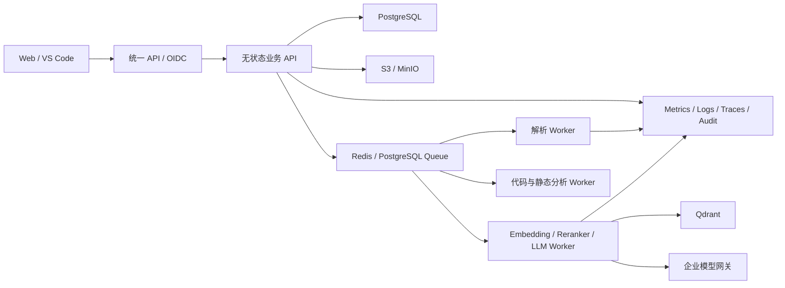

# GW/AP 智能调试平台：架构、技术栈与迭代说明

> 文档状态：2026-08-26，随仓库版本维护。
> 适用范围：当前 `debug-platform` 单体仓库，包括 Web 前端、后端 API、后台任务、VS Code 扩展、源码部署、便携部署和模型服务接入。

## 1. 项目定位

本项目面向 GW、AP、全光网关等网络设备的调试场景，将“上传日志—解析事实—检索知识—辅助诊断—关联代码—生成报告”整合为一个可在普通 Win11 电脑上本地运行、也可使用 Docker 部署的平台。

它的核心原则是：

- 原始日志、结构化事实、知识证据和模型推断分层保存；
- 即使没有任何外部模型 API，也可以用规则、BM25 和内置 Hashing Embedding 完成基础闭环；
- LLM 只能基于后端提供的证据给出辅助判断，不能直接修改日志、代码或自动应用补丁；
- 本地单机优先，同时为 PostgreSQL、Qdrant 和 OpenAI-Compatible 模型网关保留扩展路径；
- 上传、解析、诊断、模型外发和权限操作均设置明确的安全边界。

项目当前属于“可运行的工程化内部诊断平台”，不是已经完成所有厂商格式适配的商业成品。仓库已具备合成 Golden/浏览器 E2E、Agent 轨迹、数据库任务租约和有界执行基础；最重要的后续工作仍然是真实日志私有回归、生产级身份体系、集中可观测和弹性 Worker。

## 2. 总体架构


```mermaid
flowchart TB
    User["工程师 / 管理员"] --> Web["Vue 3 Web 前端"]
    User --> VSCode["VS Code 扩展"]
    Web --> API["FastAPI /api/v1"]
    VSCode --> API

    API --> Auth["鉴权、RBAC、案例权限、审计"]
    API --> Domain["案例 / 日志 / 知识治理 / 模型 / 报告服务"]
    API --> Jobs["数据库持久化任务 + ThreadPoolExecutor"]

    Jobs --> Parse["安全解压、文本识别、Parser Registry"]
    Jobs --> Diagnose["规则诊断、RAG、LLM 证据校验"]
    Jobs --> Code["代码索引、静态工具"]
    Jobs --> Reindex["知识切片、Embedding 重建"]
    Jobs --> Graph["领域图谱 generation 构建"]
    Jobs --> Eval["检索评测"]

    Domain --> DB["SQLite（本地）或 PostgreSQL（部署）"]
    Domain --> Files["文件存储：日志、解压内容、报告、源码包"]
    Reindex --> DB
    Graph --> DB
    Eval --> DB
    Reindex -.可选镜像.-> Qdrant["Qdrant"]

    Diagnose -.高级兼容模式.-> LocalModels["隔离的本地模型服务 / 旧式进程内适配器"]
    Diagnose --> ModelAPI["OpenAI-Compatible / Qwen Rerank API"]

    API --> Report["HTML / PDF / DOCX 报告"]
```

当前形态是模块化单体：

- 前端与后端分别构建；
- 后端 API、领域服务和后台任务运行在同一个 Python 进程；
- 关系数据由 SQLAlchemy 管理；
- 大文件保存在文件系统，数据库保存路径、哈希、状态和结构化结果；
- Qdrant 是可选向量镜像，关系库中的 Embedding 仍是可回退的数据源；
- Docker Compose 将前端、后端、PostgreSQL 和 Qdrant 分为独立容器。

这种结构适合单机和小团队部署，开发和排错成本较低；如果未来需要多后端实例、高并发或跨部门共享，则应把任务执行、对象存储和向量索引进一步服务化。

## 3. 技术栈

### 3.1 后端

| 领域 | 技术 | 当前用途 |
| --- | --- | --- |
| 语言与运行时 | Python 3.11+ | 后端、任务、运维脚本、测试 |
| Web API | FastAPI、Uvicorn | REST API、Swagger、健康检查、文件上传 |
| 数据校验 | Pydantic 2、pydantic-settings | 请求/响应模型和 `.env` 配置 |
| ORM 与迁移 | SQLAlchemy 2、Alembic | 数据访问、约束、SQLite/PostgreSQL 迁移 |
| 数据库 | SQLite / PostgreSQL 17 | 本地默认 SQLite；Docker 部署默认 PostgreSQL |
| HTTP 与模型 API | OpenAI Python SDK、HTTPX | OpenAI-Compatible Chat/Embedding 与 Qwen Rerank API |
| 文档生成与提取 | Jinja2、ReportLab、python-docx、pypdf、HTMLParser | HTML/PDF/Word 报告，以及案例材料的 HTML、DOCX、PDF 本地正文提取 |
| 检索 | 自研 BM25/精确词项、scikit-learn HashingVectorizer | 无外部模型时的本地检索基线 |
| 本地模型兼容 | Sentence Transformers、Transformers | 仅高级源码模式可选；不进入标准/便携运行时 |
| 向量服务 | Qdrant Client | 可选的向量镜像和查询加速 |
| 文本处理 | charset-normalizer、python-dateutil、PyYAML | 编码、时间和知识内容处理 |
| 密钥保护 | cryptography / Fernet | 模型 API Key 加密保存 |
| PostgreSQL 驱动 | psycopg 3 | PostgreSQL 连接 |

`backend/pyproject.toml` 保留可维护的兼容范围，`backend/uv.lock` 记录 Python 3.11+ 的跨平台精确解析，`backend/constraints.lock` 为现有 pip、Win11 启动脚本和 Docker 提供同一份固定版本约束。CI 会检查两份锁定结果没有漂移。大型本地模型依赖只保留在 `backend[local-models]` 高级兼容组中；源码基础安装和便携包均不会安装 PyTorch 或 Sentence Transformers。权重下载是独立持久任务：系统设置页提交受支持模型、镜像、revision 和可选代理，后端加密代理、把 revision 固定为镜像 Commit，并在同模型线程/跨进程锁内执行受管 staging generation、Range 续传和完整大小/SHA-256 校验；成功后原子切换活动指针，失败或取消继续使用上一代。该任务不改变平台 Python 环境，下载结果只供独立模型服务或人工维护的高级环境使用。

### 3.2 前端

| 技术 | 当前用途 |
| --- | --- |
| Vue 3 Composition API | 页面和交互逻辑 |
| TypeScript | 类型约束和可维护性 |
| Vite 7 | 本地开发、代理和生产构建 |
| Element Plus | 表单、表格、对话框、状态展示 |
| Axios | 调用后端 API、上传与下载 |
| Vue Router | 案例、知识库、系统设置和安全管理路由 |
| Pinia | 已接入应用；当前多数状态仍由页面局部维护 |

主要页面：

- `CasesView.vue`：案例列表和创建；
- `CaseDetailView.vue`：上传、解析、原文浏览、搜索、事件、时间线、诊断、报告和代码关联；
- `KnowledgeView.vue`：知识分类树、文档新增、上传、修改、审核、版本和回滚；
- `KnowledgeCurationView.vue`：文件夹上传、模型提炼、来源核对、人机纠错、草稿版本和人工确认；
- `CognitiveSearchView.vue`：Agentic Search、可解释多跳路径、代码/Commit 图谱和三类记忆；
- `QualityGovernanceView.vue`：领域 GraphRAG、检索评测集/运行和人工诊断反馈；
- `SettingsView.vue`：Chat、Embedding、Reranker 模型配置、测试、激活和重建索引；
- `SecurityView.vue`：用户、令牌、系统状态和审计事件。

### 3.3 VS Code 扩展

扩展使用 TypeScript、VS Code API、Axios、FormData 和 Archiver 8，实现：

- 保存或清除访问凭据；
- 创建案例；
- 上传 collectDebuginfo；
- 上传当前工作区并关联案例；
- 针对选中代码提问；
- 在浏览器中打开案例。

访问凭据优先使用 VS Code SecretStorage；配置项中的明文 API Key 仅作为旧版本兼容入口。

### 3.4 工程与运维

| 领域 | 技术 |
| --- | --- |
| Windows 启动 | BAT + PowerShell |
| Linux/macOS 启动 | Shell |
| 容器部署 | Docker、Docker Compose、Nginx |
| 持续集成 | GitHub Actions |
| 后端质量 | pytest、Ruff、compileall、pip-audit |
| 前端质量 | vue-tsc、Vite build、npm audit |
| 外部服务验证 | PostgreSQL、Qdrant 服务容器测试 |
| Windows 端到端冒烟 | 隔离数据库和备用端口启动前后端 |

## 4. 仓库结构

```text
debugplatform/
├─ AGENTS.md                  # 项目地图、边界和完成标准
├─ HARNESS_ENGINEERING.md     # Harness 状态、P1/P2 有序路线
├─ backend/
│  ├─ app/
│  │  ├─ api/                 # REST 路由
│  │  ├─ core/                # 配置、数据库、迁移、鉴权、通用工具
│  │  ├─ migrations/          # Alembic 迁移
│  │  ├─ seed_knowledge/      # 内置诊断知识
│  │  ├─ services/            # 领域服务、任务、解析器、RAG、报告
│  │  ├─ main.py              # FastAPI 入口和生命周期
│  │  ├─ models.py            # SQLAlchemy 数据模型
│  │  └─ schemas.py           # Pydantic API 模型
│  ├─ tests/                  # 后端和跨模块测试
│  ├─ Dockerfile
│  └─ pyproject.toml
├─ frontend/
│  ├─ src/views/              # 五个核心业务页面
│  ├─ src/api.ts              # Axios 客户端
│  ├─ src/router/             # 前端路由
│  ├─ Dockerfile
│  └─ package.json
├─ vscode-extension/          # VS Code 客户端
├─ deploy/windows-portable/   # 单进程便携启动器与随包说明
├─ scripts/                   # 源码启动、体检、构建、冒烟、备份和用户脚本
├─ docs/                      # 专题文档
├─ workflow/                  # Agent allowlist 与配套 OpenAPI 合同
├─ models/                    # 本地模型，Git 忽略
├─ docker-compose.yml
├─ .env.example
└─ .github/workflows/ci.yml
```

日志智能筛查内部进一步分层：`log_triage.py` 负责任务生命周期、完整文本扫描和原子发布，
`log_triage_planning.py` 负责模型 Prompt、JSON Schema、GLM 返回形态兼容、证据 ID 校验、一次
有界纠正和确定性回退；`log_triage_plan_tools.py` 与 `log_triage_trace.py` 分别封装工具调用快照和
内容安全轨迹。综合诊断由 `diagnostic_planning.py` 编排，`diagnostic_planning_contract.py` 校验
模型计划，`diagnostic_tools.py` 提供五类只读工具，`fault_tree_coverage.py` 编译稳定排查节点，
`diagnostic_planning_coverage.py` 执行逐节点门禁，`diagnostic_planning_agent.py` 执行最多二十轮循环。
这些模块通过窄的 plan/metadata/typed-tool 边界连接，避免模型适配变化影响大日志扫描。

## 5. 后端模块划分

### 5.1 API 与访问控制

`backend/app/api/routes.py` 现在只聚合案例、附件、事件、诊断、报告等核心接口；系统、
知识库、代码仓、后台任务、知识提炼、知识治理、领域图谱、检索评测和 Agent 轨迹均由
独立 `APIRouter` 挂载。聚合器从历史约 1,972 行降到约 622 行，并由架构 ratchet 阻止重新
膨胀。

鉴权支持三种模式：

- `local`：本机开发模式，不能用于 `APP_ENV=prod`；
- `api_key`：共享 API Key；
- `rbac`：本地用户、个人访问令牌和角色权限。

RBAC 之外还有案例级成员关系。案例所有者或管理员可以授予成员 `VIEWER`、`EDITOR` 等权限，实现案例之间的数据隔离。模型管理、知识修改和用户管理等敏感操作要求相应角色。

### 5.2 文件存储与安全解压

文件层保存：

- 原始上传物；
- 解压后的日志文件；
- 代码仓库压缩包及解压目录；
- 生成的 PDF、DOCX 等报告。

数据库只保存受控存储键，不直接信任用户路径。上传和解压包含以下限制：

- 默认上传上限 2 GiB；
- 默认解压总量上限 8 GiB；
- 默认归档文件数上限 20,000；
- 默认单文件上限 512 MiB；
- 默认目录深度上限 20；
- 防止路径穿越、符号链接和非普通文件；
- 记录 SHA-256 和文件大小。

### 5.3 日志识别与解析器注册表

解析入口不只依赖扩展名。上传无后缀日志时会规范化为 `.txt` 存储名，同时保留原始文件名；解压后还会根据内容探测文本。

内置解析器：

- `huawei-collectdebuginfo`：识别 `Start run collect command:` 命令段，以及 `NOTICE 2026-... 03:29:17.483[...]` 等运行日志；
- `json-line`：解析逐行 JSON 日志；
- `generic-log`：通用时间、级别、模块和错误规则。

解析器通过 `Parser Registry` 注册，并按探测置信度选择。新厂商格式可以新增独立 Parser，而不必把所有规则塞入通用解析器。

### 5.4 大日志处理

当前大日志路径针对 10 万行以上文本做了专门设计：

- 以迭代器流式读取，而不是一次性加载完整文件；
- 每 5,000 条事件批量写入数据库；
- 每 500 行记录一个稀疏文件偏移索引；
- 原文浏览可按起始行跳转；
- 搜索设置最大扫描行数，避免单请求无限占用；
- 允许少量 NUL 字节，避免厂商文本因局部异常被直接当作二进制拒绝；
- 编码和控制字节仍会做内容探测；
- 单个可解析文本默认限制为 128 MiB；
- 解析过程支持进度、取消、失败回滚和重试。

每次解析使用独立 `parse_run_id`。新结果完成并提交后才替换旧的活动结果；失败或取消时只清理本次临时事件，避免把上一次可用结果破坏掉。

### 5.5 后台任务

当前任务类型包括：

- 日志解析；
- 案例诊断；
- 知识向量重建；
- 代码仓库索引；
- 静态分析。

任务元数据和状态持久化到 `jobs` 表，执行器使用进程内 `ThreadPoolExecutor`。它支持：

- 幂等键和活动任务去重；
- 原子 lease 领取、heartbeat 和租约过期恢复；
- 进度和消息；
- 取消请求；
- 超时、失败信息、指数退避重试和 dead-letter；
- 输入、CPU、内存和墙钟资源预算；
- 后端重启后恢复未完成任务；
- 业务结果和任务完成状态在关键路径上协调提交。

多个后端实例可安全竞争数据库租约；限制是执行线程仍位于 FastAPI 实例内，尚未形成可独立
扩缩容的 Worker 控制平面。DOCX/PDF/HTML 等不可信文档已在带 Win11 Job Object 或 Linux
rlimit 的独立进程抽取。

### 5.6 诊断、RAG 与证据校验

检索流程由 Agentic Search 动态选择多路信号：

1. 默认召回知识分块和可复用记忆；
2. 按 query 意图增加代码关系多跳或 Commit → 文件 → 代码路径；
3. 各模块内部使用 BM25、精确词项、标题和可信度等信号；
4. 使用 RRF 融合不同模块；
5. 若活动 Embedding 可用，对跨模块候选统一计算余弦相似度；
6. 若活动 Reranker 可用，执行最终重排；
7. 向规则诊断或 LLM 提供带 `evidence_id` 和路径的证据。

诊断先构造确定性规则结果，再选择 Mock 或 OpenAI-Compatible Chat 模型进行综合。LLM 返回值使用 Pydantic 结构校验，并检查：

- 置信度范围；
- 根因、事实、建议的数据结构；
- 引用的 `evidence_id` 是否真实存在；
- 提示词证据字符上限；
- 模型调用失败时回退到确定性结果。

每次分析保存使用的 Provider、模型名、模型配置快照和提示版本，但不保存明文 API Key。后续切换模型不会篡改历史分析的审计信息。

诊断 Agent 的后端策略先读取全部 GW/AP/通用方法，模型随后可在每轮动态调用方法目录/全文、
知识检索、全部持久化日志筛查证据检索和 evidence 读取工具；每轮最多四次、总轮数最多二十轮。
共享运行账本优先累计供应商实际 usage/cost，并把工具输出序列化大小、墙钟时间、实际工具调用和
连续无进展轮次纳入预算；达到边界时记录稳定停止原因并进入确定性回退，正常完成故障树覆盖的
路径不受影响。每轮 Prompt 由 Context Governor 按模型窗口分区准入，超长正文进入运行内存中的
Spill Store 并用 `get_evidence` 分段续读；句柄不是证据且不持久化正文。前端可查看预算、上下文
占用、压缩次数和分区指标。
故障树流程、判断点与根因分支都有稳定覆盖 ID，并从联合方法中建立推荐 Pattern、检索词和工具入口；
只有全部节点实际检索并形成终态才接受模型规划，未执行节点不得提前写终态。工具输入输出、角色、
只读权限和方法/Pattern/节点/证据 ID 都在执行前受 Schema 门禁控制，单轮最多纠正两次；失败会持久化内容安全的错误码、字段路径、重试和模型
停止原因，并回退到确定性诊断。前端独立 `LogBrowserPanel` 负责制品清单路径解析和源行高亮。

### 5.7 代码关联与静态分析

案例可以上传代码仓库归档；需要完整历史时上传 Git Bundle：

- 提取 C/C++、Python、Java、JavaScript/TypeScript、Go 符号；
- 保存文件、行号、签名、代码片段和语言元数据；
- 建立 `CALLS`、`REFERENCES`、`INHERITS`、`IMPLEMENTS` 关系；
- 读取 Commit、父提交和文件变更，关联当前 HEAD 代码符号；
- 通过 Agentic Search 执行关键词定位、关系多跳和意图追溯；
- 可运行白名单中的 `cppcheck`、`clang-tidy`；
- `clang-tidy` 需要 `compile_commands.json`；
- 补丁建议只生成候选，不自动写入源码。

Python 使用标准 AST，其余语言主要使用正则和花括号扫描，不等同于编译器完整
语义。复杂宏、模板、条件编译、重载和动态调用可能解析不完整。

### 5.8 报告

分析结果可以：

- 在浏览器预览 HTML；
- 导出 PDF；
- 导出 DOCX；
- 保存版本号、文件路径和 SHA-256；
- 通过受控下载接口获取。

## 6. 数据模型

### 6.1 主要实体

| 实体 | 作用 |
| --- | --- |
| `UserAccount` | 用户、显示名、角色和启用状态 |
| `AccessToken` | 个人访问令牌哈希、提示、过期和撤销状态 |
| `Case` | 故障案例、设备、版本、现象、严重度和所有者 |
| `CaseMember` | 案例成员和案例级权限 |
| `Artifact` | 日志、源码包和报告输入的元数据、哈希、状态 |
| `LogEvent` | 标准化日志事件、时间、级别、模块、行号和 Parser 信息 |
| `KnowledgeCategory` | 支持父子层级的知识分类 |
| `KnowledgeDocument` | 诊断规则、历史问题、故障树、方案和参考资料 |
| `KnowledgeRevision` | 不可变知识版本快照、内容哈希和变更说明 |
| `KnowledgeCurationSession` | 文件夹提炼状态、模型快照、当前 Markdown 和最终知识关联 |
| `KnowledgeCurationSourceFile` | 来源相对路径、原文/提取哈希、提取方式、页数、文本行号和纳入状态 |
| `KnowledgeCurationRevision` | 每次模型/人工修订的不可变 Markdown、哈希和校验快照 |
| `KnowledgeCurationMessage` | 提炼工作台的人类、模型和系统消息 |
| `KnowledgeDerivation` | 来源案例/Skill 与派生分析方法的 lineage |
| `KnowledgeChunk` | 可检索的知识分块 |
| `KnowledgeEmbedding` | 按 Embedding Profile 隔离的向量 |
| `KnowledgeGraphState` | 领域图谱活动/构建 generation、状态和错误 |
| `KnowledgeEntity` | 领域实体的稳定逻辑 ID 和 generation 修订 |
| `KnowledgeEntityMention` | 实体到已审核文档/分块的证据提及 |
| `KnowledgeRelation` | 带证据的领域关系 |
| `ModelProfile` | Chat、Embedding、Reranker 的本地/API 配置 |
| `Repository` | 与案例绑定的源码仓库 |
| `CodeSymbol` | 多语言源码符号及位置 |
| `CodeRelation` | 调用、引用、继承和实现关系 |
| `CommitRecord` | Commit 元数据和父提交 |
| `CommitFileChange` | Commit 的文件变更 |
| `AgentMemory` | 情景、程序和失败记忆 |
| `AnalysisRun` | 一次诊断结果、证据和模型快照 |
| `DiagnosisFeedback` | 人工诊断结论、修正、审核和知识草稿关联 |
| `Job` | 后台任务状态 |
| `RetrievalEvaluationDataset` | 可重复运行的检索评测集 |
| `RetrievalEvaluationCase` | query、预期证据/根因、模块和 Top-K |
| `RetrievalEvaluationRun` | 配置快照、逐例结果和聚合指标 |
| `ConversationMessage` | 案例问答和引用 |
| `AnalysisRevision` | 交互问答产生的诊断/报告修订草稿、审批状态和版本溯源 |
| `Report` | 报告版本、格式、路径和哈希 |
| `AuditEvent` | 操作者、动作、资源、结果和请求上下文 |

### 6.2 关系概览


```mermaid
erDiagram
    USER_ACCOUNT ||--o{ ACCESS_TOKEN : owns
    USER_ACCOUNT ||--o{ CASE : owns
    USER_ACCOUNT ||--o{ CASE_MEMBER : joins
    CASE ||--o{ CASE_MEMBER : grants
    CASE ||--o{ ARTIFACT : contains
    CASE ||--o{ LOG_EVENT : produces
    CASE ||--o{ ANALYSIS_RUN : diagnoses
    CASE ||--o{ ANALYSIS_REVISION : reviews
    CASE ||--o{ REPOSITORY : links
    CASE ||--o{ CONVERSATION_MESSAGE : chats
    ARTIFACT ||--o{ LOG_EVENT : parsed_into
    REPOSITORY ||--o{ CODE_SYMBOL : indexes
    KNOWLEDGE_DOCUMENT ||--o{ KNOWLEDGE_CHUNK : splits
    KNOWLEDGE_DOCUMENT ||--o{ KNOWLEDGE_REVISION : versions
    KNOWLEDGE_CURATION_SESSION ||--o{ KNOWLEDGE_CURATION_SOURCE_FILE : contains
    KNOWLEDGE_CURATION_SESSION ||--o{ KNOWLEDGE_CURATION_REVISION : versions
    KNOWLEDGE_CURATION_SESSION ||--o{ KNOWLEDGE_CURATION_MESSAGE : discusses
    KNOWLEDGE_CURATION_SESSION o|--o| KNOWLEDGE_DOCUMENT : confirms_to
    KNOWLEDGE_DOCUMENT ||--o{ KNOWLEDGE_ENTITY_MENTION : evidences
    KNOWLEDGE_CATEGORY ||--o{ KNOWLEDGE_CATEGORY : nests
    KNOWLEDGE_CATEGORY ||--o{ KNOWLEDGE_DOCUMENT : classifies
    KNOWLEDGE_CHUNK ||--o{ KNOWLEDGE_EMBEDDING : embeds
    MODEL_PROFILE ||--o{ KNOWLEDGE_EMBEDDING : generates
    KNOWLEDGE_ENTITY ||--o{ KNOWLEDGE_ENTITY_MENTION : mentioned_in
    KNOWLEDGE_ENTITY ||--o{ KNOWLEDGE_RELATION : connects
    CASE ||--o{ DIAGNOSIS_FEEDBACK : receives
    RETRIEVAL_EVALUATION_DATASET ||--o{ RETRIEVAL_EVALUATION_CASE : contains
    RETRIEVAL_EVALUATION_DATASET ||--o{ RETRIEVAL_EVALUATION_RUN : executes
    ANALYSIS_RUN ||--o{ REPORT : exports
    ANALYSIS_RUN ||--o{ ANALYSIS_REVISION : revised_from
```

知识分类与文档当前在数据库中通过关联表维护；上图为便于理解而简化了中间关联表。

### 6.3 迁移历程

当前 Alembic 迁移包含：

1. `0001` 基础业务表；
2. `0002` 运行期完整性和约束增强；
3. `0003` 分析模型配置快照；
4. `0004` 原子解析批次；
5. `0005` 审计事件；
6. `0006` RBAC、令牌和案例成员；
7. `0007` 代码/Commit 图谱、三类记忆和 Agentic Search；
8. `0008` 代码/向量 generation、报告发布约束和导入状态；
9. `0009` 知识版本审核、领域图谱、人工反馈和检索评测；
10. `0010` 大模型案例提炼会话、来源、修订和对话记录；
11. `0011` Agent 运行与阶段轨迹；
12. `0012` 后台任务幂等、租约、心跳、超时、资源和 dead-letter 字段；
13. `0013` Chat 模型逐 Profile 加密代理配置；
14. `0014` 持久化 LLM 日志规划、综合诊断规划和交互问答状态；
15. `0015` GW/AP 日志来源设备/角色溯源，以及需人工审批的诊断与报告修订草稿。

后端启动时会自动执行迁移。生产升级前仍应先备份，并禁止手工修改 `alembic_version`。

## 7. 核心业务流程

### 7.1 日志上传与解析


```mermaid
sequenceDiagram
    participant U as 用户
    participant F as 前端
    participant A as FastAPI
    participant J as JobRunner
    participant P as 解析服务
    participant D as 数据库/文件存储

    U->>F: 选择有后缀或无后缀日志
    F->>A: multipart 上传
    A->>A: 文件名规范化、大小限制、SHA-256
    A->>D: 保存原始文件和 Artifact
    F->>A: 请求解析
    A->>J: 创建持久化任务
    J->>P: 安全解压、文本探测、选择 Parser
    P->>D: 分批写入带 parse_run_id 的事件
    P->>D: 原子切换活动解析批次
    F->>A: 轮询任务状态
    A-->>F: 文件清单、原文、事件、统计、时间线
```

### 7.2 诊断

```text
结构化日志事件
  + 案例设备信息
  + 分层知识文档
  + 三类任务记忆
  + 代码关系图谱
  + Commit 意图图谱
        ↓
Agentic Search 识别意图并选择检索模块
        ↓
BM25 / 图多跳 / RRF / Embedding / 可选 Reranker
        ↓
确定性规则诊断
        ↓
可选 LLM 综合
        ↓
结构、置信度和 evidence_id 校验
        ↓
分析快照、问答引用和报告
```

### 7.3 知识编辑与索引

知识库支持：

- 分类新增、修改、删除和父子层级；
- 文档新增、文件上传、查看、修改和删除；
- 诊断规则、协议规则、产品规则、安全规则；
- 历史问题、故障树、解决方案；
- 包含错误形式、日志分析、错误定位、解决方案和验证结果的结构化故障案例；
- 从日志/现象/分析/方案文件夹生成带 `[SRC-xxxx:Lx-Ly]` 证据的 LLM 案例草稿；
- 对提炼草稿执行模型多轮纠错、人工修改、不可变版本恢复和来源行号校验；
- 错误分析 Skill，以及确定性提炼的可复用分析方法；
- 产品资料和协议资料；
- 设备、型号、固件、模块、可信度和保密级别元数据；
- 内容切片；
- 切换 Embedding 后异步重建全量向量。

新建、上传、编辑和回滚均进入 `DRAFT`，经过 `IN_REVIEW` 后才能发布为 `ACTIVE`。
每次内容版本保存不可变快照和 SHA-256；数据库使用 `lock_version` 拒绝并发覆盖。
编辑已发布文档时先切换为不可检索草稿，再提交新的分块/向量。

文件夹提炼使用独立 staging 状态机。原始来源只写入本地 Storage；HTML 可见正文、DOCX
段落/表格和 PDF 文本层先转换为带稳定行号的本地 UTF-8 sidecar，再经过长文抽样、敏感
字段掩码和全局长度限制，才可发送到管理员明确选择的 API 模型。模型生成或
对话修订只改变提炼会话；章节、来源编号和行号校验通过并经人工确认后，才创建
`KnowledgeDocument(DRAFT, active=false)`。因此“生成”“人工确认”“知识审核发布”是
三个独立门禁，模型不能直接污染在线检索。

故障案例和故障树仍以 Markdown 文档为权威内容；来源与提炼分析方法之间保存派生
lineage。领域图谱只从已发布知识的元数据和结构化章节提取可审计实体/关系，并以
generation 旁路构建、输入签名校验和 CAS 切换。确定性抽取结果不等同于人工确认的
全部因果事实，仍需通过知识审核和后续实体治理提高精度。

### 7.4 模型配置与切换

模型按任务分为：

| 任务 | 内置 | 本地 | API |
| --- | --- | --- | --- |
| Chat/诊断 | Mock/规则引擎 | 暂未提供本地 Chat 运行器 | OpenAI-Compatible |
| Embedding | Hashing 384 维 | Sentence Transformers / BGE | OpenAI-Compatible Embedding |
| Reranker | Disabled | Sentence Transformers / Qwen3 | Qwen Rerank API |

前端可以新增、修改、删除、测试和激活多个 Profile。同一任务只允许一个活动配置。Embedding 切换后必须重建知识向量；旧向量按 `profile_id` 隔离，不会误用到新模型。

API Key 和 Chat 模型代理 URL 在后端使用 Fernet 加密，只返回“是否已配置”和脱敏提示，不回显明文。模型端点与代理在保存、激活和实际请求前均检查协议、主机、内网、回环和云元数据地址。代理为空时 Profile 直连；启用代理时使用独立 HTTPX Client，保留证书链和主机名验证并清除 CRL 吊销检查标志。

## 8. 模型运行边界

标准运行时只包含平台本身：

- Embedding 默认使用内置 Hashing，或连接批准的 OpenAI-Compatible Embedding API；
- Reranker 默认关闭，或连接批准的 Rerank API；
- Chat/诊断连接已配置的 OpenAI-Compatible API；
- PyTorch、Sentence Transformers、Transformers 和模型权重不进入便携包，也不会由源码启动脚本安装。

旧模型安装器曾同时向平台主 `.venv` 注入原生推理依赖并下载权重。这会把 FastAPI 生命周期与
Torch/显卡驱动/VC++ DLL 初始化绑在一起，新 Win11 设备上可能表现为
`Model connection failed: WinError 1114`。因此仓库已删除整套下载与安装脚本；需要本地
BGE/Qwen 时，应在独立目录、虚拟环境或容器中启动模型服务，再让平台通过 API 连接。

`backend[local-models]` 仅作为旧式进程内适配器的高级兼容入口保留，不属于标准安装和便携
部署支持面。根目录本机 `A.py` 已被 Git 忽略；其安全下载子集已进入前端受管任务，但仍不能
安装或隔离推理运行时，不能作为平台部署脚本。详细边界见
[Win11 便携部署](windows-portable-deployment.md)。

## 9. 部署与运行模式

### 9.1 Win11 便携模式

CI 或开发电脑执行 `scripts\build_windows_portable.bat` 后，会生成可复制的 ZIP。目标 Win11
电脑只需解压并双击 `start.bat`，不需要安装 Python、Node、pip、npm 或配置它们的代理。
便携 Python、后端基础依赖、前端静态产物和迁移都在一个目录中，FastAPI 同源提供 API 与
Vue SPA。首次运行在 `%LOCALAPPDATA%\GWAPDebugPlatform\` 自动创建 `.env` 和数据目录，
升级只替换程序目录。

构建过程强制检查便携运行时不存在 `torch` 和 `sentence_transformers`；发布前验证会从临时
数据目录启动真实服务，并检查 readiness、Vue 首页、Vue 深层路由和 API。

### 9.2 Win11 源码开发模式

`scripts\start_local.bat` 负责：

- 检查并创建 `.venv`；
- 安装后端依赖；
- 检查 Node.js 和前端依赖；
- 执行数据库迁移；
- 分别启动后端与 Vite；
- 只绑定 `127.0.0.1`；
- 检测 8000 端口是否被其他服务占用。

配套脚本：

- `doctor_local.bat`：检查 Python、Node、依赖、端口、数据库和目录；
- `runtime_smoke.bat`：用隔离 SQLite 数据库、18000/15173 端口启动完整前后端并冒烟；
- `inspect_log_file.bat`：检查日志大小、行数、头部字节、编码、NUL 和 Parser 预测；
- `backup_local.bat` / `restore_local.bat`：SQLite 本地备份和受确认保护的恢复；
- `manage_users.bat`：用户和令牌管理。

源码模式面向开发者，仍需要 Python、Node/npm，并可能需要为软件源配置公司代理。普通使用者
优先选择 9.1 的便携包。

### 9.3 Docker 模式

Docker Compose 包含：

- PostgreSQL；
- Qdrant；
- FastAPI 后端；
- Nginx 托管的前端。

数据库、向量和文件分别保存在 Docker Volume。宿主机端口只绑定 `127.0.0.1`，PostgreSQL 和 Qdrant 不直接暴露。

### 9.4 健康与备份

健康接口分为：

- liveness：进程是否存活；
- readiness：数据库和存储是否可用；
- system status：数据库方言、存储空间、任务数量和实体数量。

内置备份面向本地 SQLite，使用 SQLite 在线快照、ZIP 清单、逐文件 SHA-256 和恢复回滚目录。PostgreSQL 部署应使用企业标准的 `pg_dump`、`pg_restore` 和存储备份方案。

## 10. 已实现功能清单

### 案例与协作

- 创建、查看、修改和删除案例；
- 设备类型、型号、固件、拓扑、复现步骤、时间、状态和严重度；
- 所有者和案例成员权限；
- 跨案例数据隔离。

### 日志

- 压缩包、普通文本和无后缀日志上传；
- 无后缀日志自动规范化为 `.txt`；
- 安全解压和文件清单；
- 内容型文本探测与编码提示；
- 华为 collectDebuginfo、JSON Lines 和通用日志 Parser；
- 原始日志分页、跳行和关键字搜索；
- 事件筛选、统计和时间线；
- 大日志流式解析、批量写入和稀疏行索引；
- 原子重解析、取消、失败回滚和重试；
- 独立日志体检脚本。

### 诊断

- GW/WAN、DHCP、PPPoE、WLAN、hostapd、PON、OMCI、TR-069、内核和进程异常规则；
- 规则诊断；
- BM25、精确词项、Embedding 混合检索；
- 可选 Reranker；
- OpenAI-Compatible LLM；
- 证据编号、置信度和返回结构校验；
- 案例问答和引用；
- HTML、PDF、DOCX 报告。

### 知识库

- 层级分类；
- 诊断规则、历史故障、故障树、解决方案和参考资料分类；
- 文档新增、上传、查看、修改和删除；
- 草稿、待审核、发布、驳回和归档状态机；
- 不可变版本快照、历史恢复和数据库乐观锁；
- 结构化 Markdown 故障案例模板、必需章节检查和完整度；
- 错误分析 Skill 管理，以及来源可追溯的分析方法提炼；
- 内容切片、Embedding 索引和全量重建；
- 设备、版本、模块、可信度和保密性元数据；
- 已发布知识的确定性实体/关系抽取及原子领域图谱 generation。

### 模型网关

- 前端管理多套 Chat、Embedding 和 Reranker；
- 内置、本地、API 三种模式；
- 测试、激活、停用和删除；
- API Key 加密、不回显；
- 外发端点和 SSRF 风险校验；
- 模型外发审计；
- 分析时保存无密钥配置快照；
- 便携运行时与本地模型原生依赖隔离；
- 旧式进程内 BGE/Qwen3 适配器仅保留为高级兼容入口，不提供一体化安装器。

### 代码与工程

- 案例绑定源码归档或完整 Git Bundle；
- C/C++、Python、Java、JavaScript/TypeScript、Go 符号索引；
- `CALLS`、`REFERENCES`、`INHERITS`、`IMPLEMENTS` 关系和 1～3 跳查询；
- Commit、父提交、变更文件和当前代码符号的追溯图谱；
- 未变内容重建索引时保持符号、关系、Commit 和文件变更 evidence ID 稳定；
- 代码符号检索；
- `cppcheck`、`clang-tidy` 白名单执行；
- 候选补丁建议，不自动应用；
- VS Code 上传、提问和跳转。

### 认知检索与记忆

- `EPISODIC`、`PROCEDURAL`、`FAILURE` 三类记忆；
- 诊断、问答和 Agentic Search 每轮按结果提炼；
- 指纹去重、出现/复用计数、来源证据和失败经验；
- 案例记忆隔离，全局程序记忆写入前脱敏；
- Agentic Search 动态编排知识、记忆、代码和 Commit；
- Agentic Search 自动调度领域 GraphRAG；
- BM25、Dense Embedding、Reranker、RRF 和图关系多跳；
- 返回计划、阶段耗时、候选统计和可解释路径。

### 质量治理与评测

- 固定案例、query、预期证据、预期根因和检索模块的评测数据集；
- 后台评测运行和无密钥模型配置快照；
- Recall@K、Precision@K、MRR、NDCG@K 和 Root Cause Top-K；
- 评测显式关闭记忆写入，并且结果不复制日志、知识或源码正文；
- 人工诊断反馈提交、管理员审核和知识草稿生成；
- 反馈生成的草稿必须再次经过知识审核才能进入检索。

### 安全与运维

- local、API Key、RBAC 三种鉴权；
- 用户、个人令牌、角色和案例成员；
- 令牌只保存哈希；
- 审计事件；
- 上传、解压和路径限制；
- 敏感字段、MAC、IP、SN 脱敏；
- 健康、就绪和系统状态；
- 数据库迁移；
- SQLite 备份、校验、恢复回滚；
- Windows 诊断和隔离冒烟；
- Windows/Linux CI、依赖审计、Docker 构建和外部服务测试。

## 11. 迭代历程

| 日期 | 提交 | 迭代内容 | 解决的问题 |
| --- | --- | --- | --- |
| 2026-07-21 | `33bfc54` | 初始化仓库 | 建立版本控制起点 |
| 2026-07-21 | `4b4c9b9` | 导入完整平台工程 | 形成前后端、脚本、扩展和部署骨架 |
| 2026-07-21 | `5f7a430` | 修复可移植本地启动 | 不再依赖特定电脑工作目录，改善 Win11 克隆即用 |
| 2026-07-21 | `f881d77` | 增加华为无后缀日志解析 | 支持 collectDebuginfo 命令段和运行日志 |
| 2026-07-22 | `0a0cb48` | 无后缀上传规范化和日志体检 | 自动补 `.txt`，提供公司电脑可运行的检测文件 |
| 2026-07-22 | `52822f0` | 支持文本中的少量 NUL | 避免局部异常字节导致整份日志被判定为二进制 |
| 2026-07-22 | `4d57d54` | 修复解析器注册 | 新进程中确保内置 Parser 自动加载 |
| 2026-07-22 | `a9aa92f` | 模型网关和分层知识库 | 前端多模型切换、Embedding/Reranker、分类和文档修改 |
| 2026-07-22 | `08e932f` | Windows 启动和诊断强化 | 增加 Doctor、运行时冒烟和跨电脑启动保障 |
| 2026-07-23 | `a4ce133` | P0 安全和运维强化 | RBAC、审计、备份、健康、解析原子性和部署验证 |
| 2026-07-23 | `e6caa77` | 大日志 Windows 稳定性 | 流式解析、批量写入、稀疏索引和任务状态修复 |
| 2026-07-23 | `60df9f8` | 本地模型安装器 | 创建三级目录、镜像下载、文件与适配器验证 |
| 2026-07-23 | `583f8da` | 改用 `hf download --local-dir` | 让公司环境中的下载命令透明、直接并便于手工复现 |
| 2026-07-23 | 本文版本 | 模型下载诊断和回退 | 增加脱敏检测报告、固定 revision、curl 断点续传和哈希校验 |
| 2026-07-28 | 本次提交 | 认知检索与工程图谱 | 结构化故障案例、方法提炼、稳定 ID 的代码/Commit 图谱、三类记忆和 Agentic Search；同步消除 VS Code 扩展高危传递依赖 |
| 2026-07-29 | 本次提交 | 异步导入与原子索引 | 仓库/知识大文件后台导入、代码图谱与向量 generation 原子切换、有界混合检索、模块均衡、报告原子发布和 ZIP 清理 |
| 2026-07-30 | 本次提交 | P1/P2 质量与知识治理 | 知识版本审核和数据库乐观锁、已审核知识领域图谱/GraphRAG、可重复检索评测、人工反馈双重审批和独立 API 路由 |
| 2026-08-03 | 本地在研 | 大模型文件夹案例提炼 | 从多文件故障材料生成可引用 Markdown，支持多轮人机纠错、版本留痕和确认后进入知识草稿 |
| 2026-08-05 | 本次提交 | Harness Engineering P0 | 统一验证入口、仓库契约、CI 去重、依赖治理、Agent 地图和 main 保护规则 |
| 2026-08-05 | 本次提交 | Harness P1 与有界 Agent 基础 | 合成 Golden、Fake Model、Playwright、统一轨迹、覆盖率/架构门禁、模块拆分、任务租约、文档进程沙箱和类型化执行器 |
| 2026-08-10 | 本次修改 | Chat 模型企业代理 | 前端逐模型代理、代理凭据加密、显式直连默认值、受限 TLS 吊销策略和连接状态提示 |
| 2026-08-11 | 本次修改 | 私网端点与通用知识范围 | 一次性脚本持久启用受控私网模型地址；知识新增 GENERAL 通用适用范围并兼容旧 OTHER 检索 |
| 2026-08-14 | 本次修改 | 原生诊断工具 Agent 与可观测性 | Thinking 三态、两至二十轮只读工具调用、故障树逐节点覆盖与结论门禁、全量持久化筛查证据检索、回退诊断、文档/方法可视化、日志级别文案和精确源行跳转 |
| 2026-08-21 | 本次修改 | Agent Context 与可度量运行时 | token-aware Context Governor、临时 Spill Handle、供应商实际 usage/工具输出预算、真实依赖深度、36 场景 Golden 分布契约和前端上下文可视化 |
| 2026-08-26 | 本次修改 | Win11 便携发布与模型隔离 | 单 ZIP 同源启动、外置数据/配置、解释器与文件完整性门禁、真实便携冒烟；删除会污染主 `.venv` 的模型安装链 |

这段迭代体现了项目从“功能原型”逐步转向“可在多台 Win11 电脑复现、可诊断、可回滚、可审计”的工程化过程。

## 12. 当前优点

### 12.1 离线可用和逐级增强

没有 API Key 时仍可使用解析、规则、BM25、Hashing Embedding 和报告；有批准的 API 后可启用语义模型、排序和 LLM。确需本地模型时通过隔离服务接入，不让原生推理 DLL 污染平台进程。企业环境可以按数据合规等级逐步开放能力。

### 12.2 证据驱动

诊断不是让 LLM 直接阅读无限量原始日志并自由回答，而是先结构化事实和检索证据，再验证模型引用。历史分析保存模型快照，便于复盘。

### 12.3 针对真实大日志问题做了工程处理

无后缀、混合编码、少量 NUL、10 万行以上文本、Windows SQLite 写入速度、任意行浏览和原文搜索都有对应实现，不只停留在小样例演示。

### 12.4 扩展点清晰

Parser、模型 Profile、知识分类、任务类型、报告格式和静态工具都有相对明确的边界。新厂商 Parser 或新模型适配器可以局部扩展。

### 12.5 便携、源码和容器三条运行路径

普通工程师可以解压便携包后双击使用；开发者保留源码 BAT；团队部署可以使用 PostgreSQL、Qdrant 和容器。CI 同时验证 Windows 和 Ubuntu，并单独构建和冒烟 Win11 便携制品，降低“只在开发者电脑可用”的风险。

### 12.6 安全意识较完整

上传限制、解压防护、路径约束、令牌哈希、API Key 加密、模型端点校验、审计、案例隔离和静态工具白名单已经覆盖了内部平台的主要高风险入口。

## 13. 当前缺点与技术债

### 13.1 剩余核心案例路由仍可继续细分

系统、知识、代码仓和任务等领域已从 `routes.py` 拆出，当前聚合器低于默认单文件上限。
案例、附件、事件、诊断和报告之间仍有较强协作，未来可在保持案例权限依赖一致的前提下继续
拆分；当前行数、复杂度和反向导入已由 CI ratchet 约束。

### 13.2 后台任务仍缺少独立弹性 Worker

数据库任务已具备 lease、heartbeat、幂等、退避和 dead-letter，多 FastAPI 实例不会正常领取
同一任务；执行线程仍随 API 进程部署。高并发生产环境可把同一领取协议迁移到独立 Worker，
或接入 Redis/Celery、Dramatiq、RQ 等专用队列。

### 13.3 SQLite 中保存 JSON 向量的规模有限

SQLite 回退可靠，但向量仍以 JSON 文本保存，文档数量大时存储和全量向量行扫描成本会上升。本轮已让 Qdrant 走有界 top-K，并通过 generation 避免半套索引；双写告警和自动一致性修复仍可继续完善。

### 13.4 领域知识图谱抽取与治理仍有限

当前已经从已审核知识构建设备、版本、模块、症状、事件码、日志模式、根因、诊断步骤、
解决方案、验证和范围实体/关系，并支持 generation 原子切换和 GraphRAG。但提取仍是
确定性 Markdown/元数据规则，尚无同义实体合并、冲突关系审批、复杂跨文档因果推断和
图形化编辑。因此它是可审计的领域图谱基础，不是完整企业知识本体。

### 13.5 Parser 的真实产品覆盖仍有限

内置华为 Parser 基于目前掌握的文本特征。仓库合成 Golden 可以阻断代码回归，但不能代表
不同产品线、版本和内部模块的全部字段变化；缺少来自真实设备、经过审批脱敏的私有 Golden
Corpus，仍是当前诊断准确率最大的风险。

### 13.6 代码图谱仍是启发式语义模型

Python 使用 AST，其余语言当前主要使用安全语法启发式。对常规符号、调用、引用、
继承和实现关系有效，但复杂 C++ 宏展开、条件编译、模板、重载以及动态语言调用仍会
缺边或产生歧义边。后续应接入 Clang/Tree-sitter/Language Server 和编译数据库。

### 13.7 前端组件级覆盖仍有限

Playwright 已在 Windows/Ubuntu CI 固化知识提炼和轨迹完整流程，并把控制台错误设为失败；
提炼 View 也拆出类型化 API Client、Composable 和领域组件。当前仍缺少更细粒度的组件测试，
其他页面的浏览器关键路径可继续扩展。

### 13.8 本地模型服务仍需独立产品化

平台已停止把 Torch 和模型权重装入主运行时，但仓库尚未提供正式的独立本地模型服务制品。
后续若恢复本地 BGE/Qwen，应建设独立进程或容器、固定版本与权重哈希、许可证清单、恶意
模型扫描、CPU/GPU 容量准入、健康检查和超时/熔断；在此之前优先使用批准的模型 API。

### 13.9 生产身份和密钥基础设施不足

当前 RBAC 是本地账号和 Token，不含公司 SSO/OIDC、SCIM、MFA、集中密钥托管或自动轮换。Fernet 密钥仍由本地文件或环境管理。

### 13.10 可观测性偏基础

已有健康、系统状态、任务状态和审计，但缺少 Prometheus 指标、结构化日志规范、分布式 Trace、SLO、告警和容量趋势。

### 13.11 文件存储仅为本地文件系统

单机简单可靠，但多实例需要共享对象存储、生命周期、版本和防病毒扫描。当前未集成 S3/MinIO，也没有上传恶意内容扫描。

### 13.12 案例提炼的文档类型与上下文仍有限

当前支持文本/无后缀文本、HTML/HTM、Word `.docx` 和带文本层的 PDF。旧式 `.doc`、扫描
PDF、图片、电子表格和抓包文件会保留但不会提取，其中 OCR 尚未实现。HTML 不执行脚本、
样式或远程资源；DOCX 只读取正文段落和表格；PDF 的复杂多栏布局可能出现阅读顺序偏差。
长材料使用头部、关键词行和尾部的确定性抽样，能控制 Token 和数据出站量，但可能遗漏
没有命中关键词的关键上下文。后续应增加 OCR、PCAP 摘要、来源级选择/排除、发送前证据
预览和面向不同产品的提炼评测集。当前也只有 API Chat 模型，没有本地生成模型运行器。

## 14. 改进空间与建议路线

### P0：上线前必须补齐

1. **真实日志回归集**
   - 对公司日志脱敏；
   - 按产品、版本、模块建立 Golden Files；
   - 固定预期 Parser、事件数、关键事件、时间线和诊断证据；
   - 加入 100 MiB 级别性能门槛。

2. **模型制品治理**
   - 建立 revision 升级审批和回归机制；
   - 归档文件 SHA-256、许可证和来源清单；
   - 公司环境优先使用审核后的内部模型制品库；
   - 下载前检查剩余磁盘，加载前检查内存。

3. **生产鉴权**
   - 接入公司 OIDC/SSO；
   - 明确管理员、知识维护者、诊断工程师、只读用户；
   - 令牌轮换、强制过期和离职回收。

4. **可观测和告警**
   - 解析耗时、行数、事件率、失败率；
   - Job 排队时间和执行时间；
   - 模型延迟、Token、错误和外发量；
   - 磁盘、数据库和 Qdrant 容量；
   - 关键审计事件集中告警。

5. **上传安全**
   - 接入 ClamAV 或公司恶意文件扫描；
   - 文件类型识别与隔离区；
   - 上传保留期限和自动清理策略。

### P1：规模化和可维护性

| 能力 | 状态 | 当前结果与下一步 |
| --- | --- | --- |
| 拆分大型 API 路由和前端 View | `AVAILABLE` | system/knowledge/repository/jobs、知识提炼子模块和前端 API/composable/component 已拆分，并有行数 ratchet |
| 多实例任务领取 | `AVAILABLE` | 数据库 lease/heartbeat/dead-letter 已完成；独立弹性 Worker 仍是后续增强 |
| 生产统一 PostgreSQL | `PLANNED` | Compose 和 CI 已验证 PostgreSQL；尚未禁止生产 SQLite 或固化容量参数 |
| S3/MinIO 对象存储 | `PLANNED` | 当前仍是单机文件目录 |
| Qdrant 正式服务与可重放索引 | `IN_PROGRESS` | 已有 generation、失败回滚和有界查询；仍需任务租约、对账和自动修复 |
| Playwright 端到端测试 | `AVAILABLE` | Windows/Ubuntu CI 执行混合文档上传、预览、提炼、纠错、确认 DRAFT、轨迹及控制台零错误 |
| Parser 版本化插件与样本契约 | `LIMITED` | 现有注册表和合成 Golden Contract 可扩展；真实厂商私有样本仍需内网治理 |
| Tree-sitter / Clang AST | `PLANNED` | 当前 Python AST，其余语言主要为启发式解析 |
| 检索与诊断评测 | `AVAILABLE` | 已有可重复检索评测和五项指标；仍需最终诊断语义评分与内网回归门禁 |
| GPU、量化和模型懒加载 | `PLANNED` | 当前由 Profile 手工设置设备和批量 |

### P2：平台化能力

| 能力 | 状态 | 当前结果与下一步 |
| --- | --- | --- |
| 实体—关系知识图谱和 GraphRAG | `LIMITED` | 已支持已审核知识的确定性实体/关系、原子 generation 和 Agentic 调度；待实体消歧、冲突审核和图编辑 |
| 多租户、部门空间和知识 ACL | `PLANNED` | 当前是全局知识加案例级权限 |
| 诊断工作流、人工审批和反馈 | `IN_PROGRESS` | 已有知识状态机和人工反馈双重审批；尚无通用可配置工作流引擎 |
| 反馈驱动规则/模型评估 | `AVAILABLE` | 反馈和离线评测已隔离；不会未经审批自动学习敏感内容，待建立内网门禁 |
| Kubernetes、弹性 Worker 和灾备 | `PLANNED` | 需先完成分布式队列与对象存储 |
| Parser、规则、模型和知识版本发布 | `IN_PROGRESS` | 知识版本/审核已完成；Parser、规则和模型制品发布仍待实现 |
| 拓扑、事件传播链和跨设备时间对齐 | `PLANNED` | 当前仅保存基础拓扑文本和单案例时间线 |

## 15. 推荐的目标架构

当单机部署无法满足需求时，可逐步演进为：


```mermaid
flowchart LR
    UI["Web / VS Code"] --> Gateway["统一 API / OIDC"]
    Gateway --> App["无状态业务 API"]
    App --> PG["PostgreSQL"]
    App --> S3["S3 / MinIO"]
    App --> Queue["Redis / PostgreSQL Queue"]
    Queue --> ParseWorkers["解析 Worker"]
    Queue --> AIWorkers["Embedding / Reranker / LLM Worker"]
    Queue --> CodeWorkers["代码与静态分析 Worker"]
    AIWorkers --> Vector["Qdrant"]
    AIWorkers --> ModelGateway["企业模型网关"]
    App --> Observability["Metrics / Logs / Traces / Audit"]
    ParseWorkers --> Observability
    AIWorkers --> Observability
```

迁移不必一次完成。建议先保持现有 API 和数据模型稳定，依次替换任务执行器、文件存储、向量主存储和身份入口。

## 16. 质量保障现状

当前测试覆盖的重点包括：

- 鉴权、RBAC、案例隔离和审计；
- 上传、解压、路径和大小安全；
- 无后缀、少量 NUL、华为日志和大日志；
- Parser 注册和解析原子性；
- Job 幂等、lease/heartbeat、取消、退避重试、dead-letter、恢复和资源预算；
- RAG、模型 Profile、模型快照和 LLM 输出校验；
- 故障案例结构检查、方法派生及删除一致性；
- 知识审核状态机、不可变版本、并发乐观锁和历史恢复；
- 领域图谱构建、GraphRAG、失败/输入变化时保留旧 generation；
- 多语言代码四类关系、Commit/Unicode 路径和 Git Bundle；
- 三类记忆的去重、脱敏、案例隔离和复用；
- Agentic Search 规划、融合、Dense/Reranker 回退和多跳路径；
- 类型化 Tool Registry、角色/写审批、执行预算、重试熔断取消和显式停止原因；
- Agent 轨迹摘要哈希、证据、审批状态、前端查看和脱敏只读重放；
- 不可信 DOCX/PDF/HTML 的 Win11/Linux 受限独立进程抽取；
- 检索评测指标、配置快照及评测期间零记忆写入；
- 人工反馈审核和生成待二次审核知识草稿；
- 迁移、外键和数据库完整性；
- 健康、备份、删除级联和部署文件；
- Windows 源码启动、Doctor、便携包构建和隔离冒烟；
- PostgreSQL 与 Qdrant 外部服务。

GitHub Actions 当前验证：

- Windows/Ubuntu 后端测试、Ruff 和 compileall；
- Windows/Ubuntu 75% 后端行覆盖率门禁和 coverage.xml；
- Windows/Ubuntu 前端构建；
- Windows/Ubuntu Playwright 混合文档与轨迹 E2E；
- 十类 Golden Dataset 质量、耗时、引用和停止原因门禁，其中 36 场景矩阵当前是分布契约、核心案例是完整可执行样本；
- VS Code 扩展编译；
- Python 与 npm 依赖审计；
- PostgreSQL/Qdrant 集成测试；
- 后端和前端 Docker 构建；
- Windows 前后端完整启动冒烟。
- Windows 便携 ZIP 自检、真实同源启动和制品上传。

仓库还提供 `scripts\validate_all.bat Fast|Full|External` 作为 Win11 的统一执行入口，
把每一步的退出码、耗时和日志写入 `artifacts\validation`。CI 同时执行
`scripts/check_repo_harness.py`，防止文档断链、能力总账遗漏、触发器重复、Dependabot
覆盖不足以及 `workflow/skill.yaml` 与 `workflow/openapi.yaml` 漂移。根目录
`AGENTS.md` 只保存短项目地图和强约束，详细路线由 `HARNESS_ENGINEERING.md` 维护。

仍应补充真实模型加载 CI、更多页面/组件 E2E 和经过审批的真实日志回归。由于模型权重大、公司日志敏感，这两类测试更适合在企业内网 Runner 执行。

## 17. 架构结论

当前项目最强的部分是：从真实 Win11 使用问题出发，已经形成日志解析、证据检索、
模型切换、知识审核、领域/工程图谱、经验记忆、认知检索、离线评测、人工反馈、
权限审计和报告的完整闭环，并且保留了无 API、无 GPU 时的可用路径。

当前最大的风险不是“功能数量不够”，而是三个工程化问题：

1. 公开仓库只有合成 Golden Corpus，仍缺少足够多的真实设备私有回归样本；
2. 执行线程、本地文件和 SQLite 回退不适合大规模弹性部署；
3. 生产级 SSO、可观测、模型制品治理和安全扫描仍需接入公司基础设施。

后续迭代应优先扩展企业内网真实日志回归、独立 Worker、集中观测和任务控制 DAG，
再扩展复杂图谱推理和多租户能力。这样可以避免功能不断增加，但准确率、可复现性和
生产安全无法证明。
