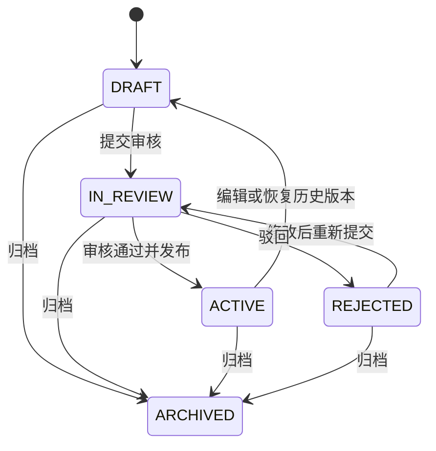
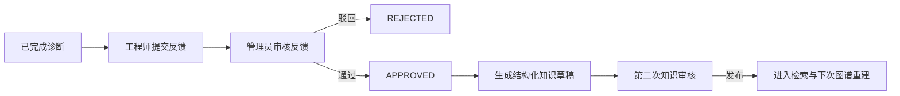

# 知识治理、领域图谱与检索评测

本文说明“质量与治理”页面及其后端能力，包括知识审核、不可变版本、领域知识图谱、
GraphRAG、检索评测和人工诊断反馈。接口前缀均为 `/api/v1`。

## 1. 设计目标

这组功能解决四类问题：

1. 未审核或正在修改的知识不能参与正式检索；
2. 图谱或索引重建失败时，不能把半成品暴露给查询；
3. 检索效果必须能用固定数据集重复测量，而不是只凭页面观感；
4. 人工反馈可以沉淀为经验，但不能未经审批自动学习日志或错误结论。

默认 `local` 模式中的本地身份是管理员。启用 RBAC 后：

- 知识发布、归档、回滚、领域图谱重建、评测集和评测运行仅管理员可操作；
- 有案例写权限的工程师可以提交该案例的诊断反馈；
- 案例只读成员可以查看有权访问的反馈，但不能提交或修改；
- 反馈审核和生成知识草稿仅管理员可操作。

## 2. 知识生命周期与版本

### 2.1 状态机



状态含义：

| 状态 | 是否可被知识检索 | 含义 |
| --- | --- | --- |
| `DRAFT` | 否 | 新建、导入、编辑或回滚产生的草稿 |
| `IN_REVIEW` | 否 | 已提交，等待管理员审核 |
| `ACTIVE` | 是 | 已审核并发布 |
| `REJECTED` | 否 | 审核未通过，可修改后重新提交 |
| `ARCHIVED` | 否 | 已归档，不再参与检索 |

创建和上传知识始终得到草稿。编辑已发布文档时，系统在同一事务中增加 `version`
和 `lock_version`、撤下当前发布态并切换为 `DRAFT/active=false`，然后提交新的分块
和向量。旧内容保留在不可变版本快照中，但审核期间不继续服务检索。因此未重新审核
的内容不会被 BM25、Dense、Reranker 或领域 GraphRAG 返回。

### 2.2 `version` 与 `lock_version`

- `version` 是用户可见的知识内容版本，从 1 递增；
- `lock_version` 是数据库乐观锁。前端保存、提交审核、发布和回滚时必须带上页面读取
  到的值；
- 如果另一位用户已经修改同一文档，后到的写入返回 `409 Conflict`，需要刷新后重试；
- 数据库 UPDATE 同时校验旧 `lock_version`，并发请求不能同时覆盖彼此。

每个版本在 `knowledge_revisions` 中保存不可变快照、内容 SHA-256、变更说明、操作者和
时间。恢复历史版本会创建一个新的草稿版本，不覆盖或删除已有历史。

## 3. 领域知识图谱与 GraphRAG

### 3.1 数据来源

领域图谱只读取同时满足以下条件的知识：

- `review_status=ACTIVE`；
- `active=true`。

当前提取器是可审计的确定性规则，不调用外部 LLM。它从文档元数据、结构化 Markdown
章节和错误码样式中提取：

- 实体：知识主题、症状、设备类型、设备型号、固件、模块、日志模式、事件码、
  根因、诊断步骤、解决方案、验证方法和适用范围；
- 关系：`HAS_SYMPTOM`、`HAS_LOG_PATTERN`、`MENTIONS_EVENT_CODE`、`CAUSED_BY`、
  `HAS_DIAGNOSIS_STEP`、`RESOLVED_BY`、`VERIFIED_BY`、`APPLIES_TO`。

每个实体、关系和证据文档都有稳定逻辑 ID；具体 generation 中的记录使用独立修订 ID。
关系仍存储在 PostgreSQL/SQLite 关系表中，当前不依赖 Neo4j。

### 3.2 原子重建

重建采用 generation 协议：

1. 在新 generation 中旁路创建实体、提及和关系；
2. 记录构建输入签名；
3. 发布前重新验证活动知识未变化；
4. 使用 compare-and-swap 一次切换活动 generation；
5. 保留当前和上一个成功 generation，再清理更旧数据。

如果提取失败、任务取消、并发重建抢先发布，或知识在构建期间发生变化：

- 新 generation 被清理；
- 上一个活动 generation 继续服务查询；
- 状态变为 `STALE` 或 `FAILED`；
- 错误信息会显示在状态接口和后台任务中。

发布、归档、删除或修改活动知识会将图谱标为 `STALE`。旧图仍可用于排查，但正式评测
前应在“质量与治理 → 领域图谱 / GraphRAG”点击“原子重建图谱”。

### 3.3 GraphRAG 查询

GraphRAG 先按 query 命中实体，再沿关系做 0～3 跳扩展，最后返回：

- 命中的实体与关系；
- 每条路径的方向、关系类型和证据 ID；
- 关联的已发布知识分块；
- 图谱 generation 和状态。

Agentic Search 检测到活动领域图谱后会把 `domain_graph` 作为可调度模块，与知识
BM25/Dense、代码图谱、Commit 图谱和记忆结果统一融合。图谱为 `STALE` 时仍保留旧版
可用性，并在结果元数据中显式标记状态。

## 4. 可重复检索评测

### 4.1 评测集

评测集由多个用例组成。每个用例固定：

- 关联案例；
- query；
- 预期 evidence/chunk ID，可留空；
- 可接受的根因短语，可留空；
- 要调度的模块；
- `top_k` 和最大图跳数。

运行评测时会保存算法版本、数据集更新时间和当前 Chat/Embedding/Reranker 配置快照，
但不保存 API Key。

### 4.2 指标

| 指标 | 计算含义 |
| --- | --- |
| Recall@K | Top-K 命中的预期证据数 / 预期证据总数 |
| Precision@K | Top-K 命中的预期证据数 / K |
| MRR | 第一个预期证据排名的倒数 |
| NDCG@K | 按排名折损后的证据命中质量 |
| Root Cause Top-K | Top-K 检索内容是否包含任一可接受根因短语 |

Root Cause Top-K 当前衡量“检索结果中是否出现预期根因”，不是对 LLM 最终诊断文本的
语义评分。没有填写预期证据或根因的用例，对应指标为 `null/—`，不会被错误计为 0。

评测调用 Agentic Search 时强制 `record_memory=false`。运行不会新增、强化或增加记忆
复用次数；结果只保存证据 ID、排名、分数、模块和执行 trace，不复制知识、日志或源码
正文。

## 5. 人工反馈闭环



反馈可以记录总体结论、根因是否正确、证据是否正确、说明、确认根因、确认方案和确认
依据。安全门共两层：

1. 未审核反馈不能生成知识；
2. 已审核反馈只能生成 `DRAFT` 故障案例，仍需走知识审核才能进入检索。

系统不会从反馈自动修改规则、模型权重、记忆或已发布知识。生成的草稿保留来源案例、
诊断运行和反馈 ID，便于审计。

## 6. 前端操作

### 知识审核

1. 在“知识库”新增、上传或编辑文档；
2. 检查状态为“草稿”及版本号；
3. 点击“提交审核”；
4. 管理员点击“发布”或“驳回”；
5. 点击“版本”查看快照，必要时恢复为新的草稿版本。

### 图谱和评测

1. 先发布经过确认的知识；
2. 打开“质量与治理”并重建领域图谱；
3. 用已知症状或错误码执行 GraphRAG 检索，检查证据和路径；
4. 新建评测集，添加关联案例、query 和预期证据/根因；
5. 运行评测并比较每次运行的配置与指标。

### 人工反馈

1. 选择案例和一条已完成诊断；
2. 填写反馈并提交；
3. 管理员在队列中审核；
4. 对通过的反馈点击“生成知识草稿”；
5. 返回知识库补充内容并完成第二次审核。

## 7. 主要 API

```text
GET  /knowledge/{document_id}/revisions
POST /knowledge/{document_id}/review/submit
POST /knowledge/{document_id}/review/approve
POST /knowledge/{document_id}/review/reject
POST /knowledge/{document_id}/review/archive
POST /knowledge/{document_id}/revisions/{version}/rollback

GET  /knowledge/graph/status
POST /knowledge/graph/rebuild
POST /knowledge/graph/search

GET|POST         /evaluation/datasets
PATCH|DELETE     /evaluation/datasets/{dataset_id}
GET|POST         /evaluation/datasets/{dataset_id}/cases
PATCH|DELETE     /evaluation/datasets/{dataset_id}/cases/{evaluation_case_id}
GET|POST         /evaluation/datasets/{dataset_id}/runs
GET              /evaluation/runs/{evaluation_run_id}

GET|POST /cases/{case_id}/diagnosis-feedback
POST     /cases/{case_id}/diagnosis-feedback/{feedback_id}/review
POST     /cases/{case_id}/diagnosis-feedback/{feedback_id}/incorporate
```

完整请求结构以本机 Swagger 为准：`http://127.0.0.1:8000/docs`。

## 8. 当前边界

- 领域实体抽取依赖结构化 Markdown 和确定性模式，复杂同义词、冲突实体和跨文档因果
  仍需人工治理；
- 当前没有图数据库、实体合并 UI 或图形拖拽编辑器；
- 评测是管理员触发的后台运行，尚未设置版本间回归阈值或 GitHub CI 门禁；
- Root Cause Top-K 是短语匹配，后续可增加人工标注的语义等价集合或受控判分模型；
- 当前知识审核角色复用 `ADMIN`，尚未拆出独立的知识维护者/审核者角色；
- 当前没有“线上已发布版本 + 并行工作草稿”双分支；编辑发布文档后，该文档会暂时
  退出检索，直到新版本再次发布；
- 页面已完成真实浏览器冒烟，但仓库尚未加入自动化 Playwright E2E。

数据库结构由 Alembic `0009_knowledge_governance_graph_evaluation` 建立。升级前仍应先运行
本地备份脚本，禁止手工修改 `alembic_version`。
